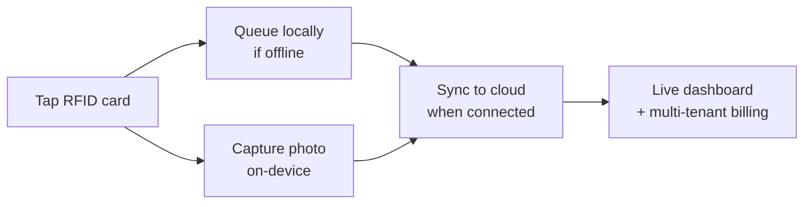
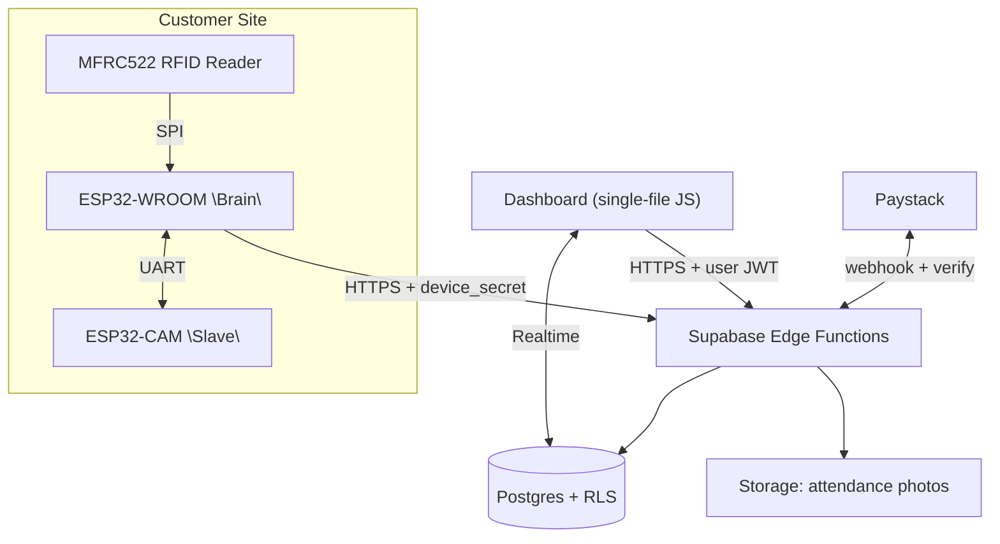
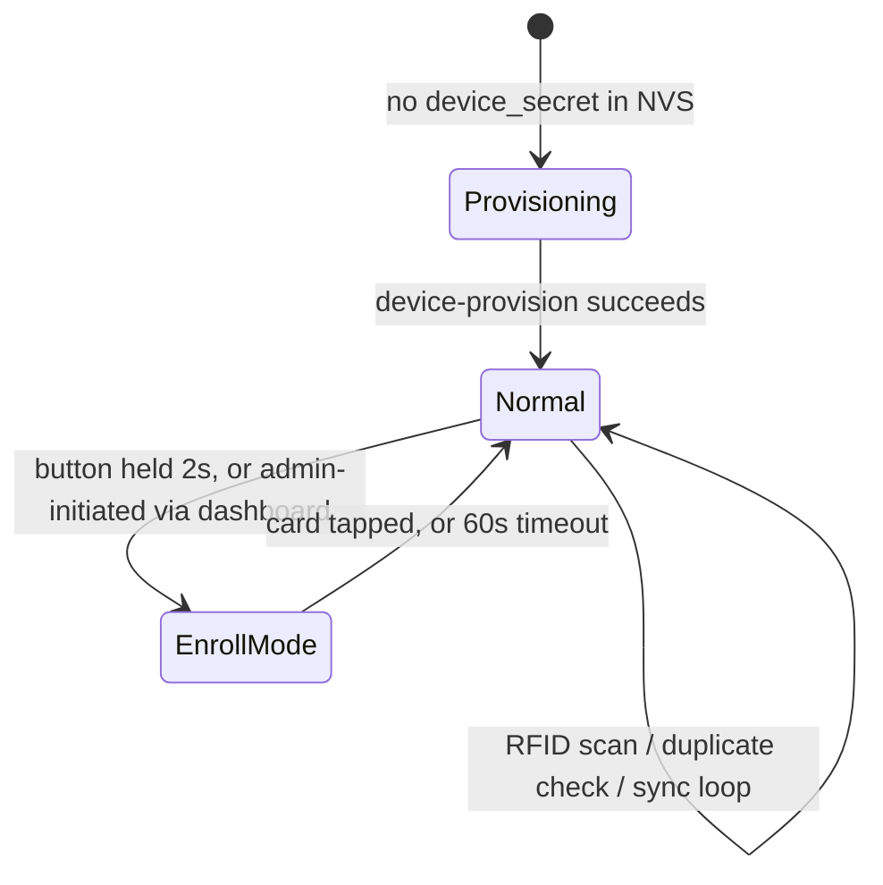
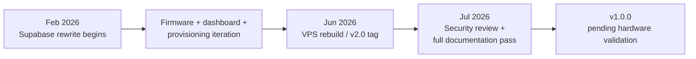

# Gateman

> Multi-Tenant RFID Attendance & Presence Platform

[](https://www.espressif.com/en/products/socs/esp32)
[](https://isocpp.org/)
[](https://supabase.com/)
[](dashboard/index.html)


[](docs/BUSINESS_MODEL.md)

> A two-board ESP32 system that reads RFID cards, captures a photo per event, and syncs to a multi-tenant Supabase backend — built to demonstrate how embedded firmware, cloud architecture, and SaaS billing come together into one deployable, sellable product.

An RFID tap-in/tap-out attendance logger with photo capture, offline queueing, QR-code device provisioning, and a multi-tenant web dashboard — built solo, currently deployed to production on a real VPS, and now brought through a formal security-hardening and documentation pass ahead of its first tagged release.

## Live Deployment — verified end-to-end 2026-07-19

- **Dashboard:** https://gateman.89.167.93.25.sslip.io (static file, Caddy on Hetzner VPS `89.167.93.25` — see [`docs/WIKI.md`](docs/WIKI.md) §8.3 for the deploy procedure)
- **Hardware wiring physically verified** (continuity-tested wire by wire): [`docs/WIRING.md`](docs/WIRING.md) — pinouts, wire colours, circuit diagram, power topology, rebuild checklist. Circuit diagram images in [`public/`](public/)
- **Full pipeline proven:** RFID tap → user lookup → CAM photo → Supabase insert → photo in Storage → live dashboard feed
- **Observability added:** dashboard shows a global health banner (subscription blocking / device offline), per-device last-seen, unknown-card alerts, and a rejection log fed by `submit-log` audit events — added after a trial-expiry silently rejected all device logs for 4 months
- **Server-side queue self-cleaning:** `submit-log` accepts-and-discards stale or unparseable timestamps (auditable) so devices purge their own offline queues — see [`docs/WIKI.md`](docs/WIKI.md) §3.2 and the `timestampToISO` firmware bug documented in §9

## Project Information

| | |
|---|---|
| **Role** | Founder & Sole Engineer (firmware, backend, dashboard, security, documentation) |
| **Duration** | February 2026 – present (ongoing) |
| **Team Size** | 1 (solo) |
| **Type** | Independent commercial product (not academic) |
| **Focus** | Embedded IoT + Multi-Tenant SaaS |

`git log` traces the tracked history back to 2026-02-27 (the Supabase-backed rewrite); no earlier version-controlled history exists for this repository, so that date marks the start of *this* architecture, not necessarily the first line of code ever written for the idea.

## Project Highlights

- ✓ Solo-built, end-to-end: firmware, multi-tenant backend, billing, dashboard, security review, documentation
- ✓ Two-board ESP32 firmware (WROOM + CAM) with an offline-tolerant sync queue
- ✓ Multi-tenant Postgres schema with Row Level Security on every table
- ✓ QR-code device provisioning with single-use, time-limited tokens
- ✓ Paystack subscription billing with signature-verified, idempotent webhooks
- ✓ Deployed to production on a real VPS, serving a real customer site
- ✓ Found and fixed three critical/moderate cross-tenant security vulnerabilities as part of preparing this v1.0.0 release
- ✓ 17-document engineering documentation set, every claim traced to source

## Why I Built This

> `TODO:` this section is intentionally left for the actual story — the specific need, the specific frustration, the specific moment this became worth building. Everything else in this README is verifiable against the code or `git log`; personal motivation isn't, so it isn't invented here.

## Problem

Manual attendance and access logging — paper sign-in sheets, standalone card readers with no central record, or enterprise access-control platforms priced and scoped for large facilities — leaves small and mid-sized organizations without a reliable, affordable attendance record:

- **Paper and standalone readers don't produce queryable data.** No dashboard, no export, no photo record for accountability.
- **Enterprise access-control platforms are priced for enterprises.** SMEs that outgrew a sign-in sheet aren't the target market for a Verkada-scale deployment.
- **Connectivity isn't always guaranteed.** A system that only works with a live internet connection fails exactly when a small site's WiFi is flakiest.

## Solution



Two ESP32 boards per site read the card, capture a photo, and queue the event locally if the network is down — syncing automatically once connectivity returns. A multi-tenant Supabase backend turns that stream of events into a live dashboard, CSV exports, and subscription billing, so one deployable hardware+software product serves many independent customer organizations from one codebase.

## Engineering Principles

### Never Break Working Hardware

Firmware changes are gated behind physical hardware acceptance testing (see [`docs/TESTING.md`](docs/TESTING.md)) — a change that looks obviously correct in code review still doesn't ship to the fleet without that validation gate. This governed the entire v1.0.0 hardening pass: security fixes that touched dashboard-only code shipped immediately; a known plaintext-secret issue that touches the device authentication path was deliberately deferred rather than bundled in. See [`docs/SECURITY.md`](docs/SECURITY.md).

### RLS Is the Default Trust Boundary

Anything that bypasses Postgres Row Level Security — a `SECURITY DEFINER` function, a service-role Edge Function — gets the same scrutiny RLS would have provided automatically. This principle exists because of a real bug, not as a theoretical ideal: one RPC was written outside the pattern the others used and shipped without the membership check every other RPC had. See [`docs/SECURITY.md`](docs/SECURITY.md) fix #2 and [`docs/LESSONS_LEARNED.md`](docs/LESSONS_LEARNED.md) §5.

### Buy Proven Modules, Don't Chase Custom Silicon Early

The two-board split exists because of real GPIO constraints on the ESP32-CAM, not novelty — and any future hardware consolidation is scoped around off-the-shelf modules (e.g. a single ESP32-S3 camera board), not a custom PCB, until volume justifies the tooling cost. See [`docs/ROADMAP.md`](docs/ROADMAP.md).

### Documented Tradeoffs, Not Overclaimed Results

Every real limitation in this system — the disabled hardware watchdog, the lack of OTA updates, a confirmed enrollment-photo bug, plaintext device secrets — is written down in [`docs/SECURITY.md`](docs/SECURITY.md) and [`docs/FIRMWARE.md`](docs/FIRMWARE.md) rather than glossed over. Anything that couldn't be verified against the actual source is marked `TODO: Needs verification` instead of guessed, across every document in [`docs/`](docs/).

## Key Capabilities

### RFID Attendance Logging
Tap-in/tap-out events with duplicate-tap suppression and idempotent sync — a retried upload can never create a duplicate record. [Details →](docs/FIRMWARE.md)

### Photo Capture with Graceful Fallback
A second ESP32 board captures a photo per event; if it's unreachable, the event still logs without blocking the primary flow. [Details →](docs/FIRMWARE.md)

### Offline-Tolerant Sync
Both boards queue locally (SPIFFS / SD card) and sync automatically once connectivity returns. [Details →](docs/FIRMWARE.md#14-known-limitations)

### QR-Code Device Provisioning
A single-use, 10-minute token generated from the dashboard, scanned by the device's own captive portal — no manual credential entry beyond WiFi. [Details →](docs/PROVISIONING.md)

### Multi-Tenant Dashboard
Live attendance feed (Supabase Realtime), employee management, remote card enrollment, CSV export, device management — one dashboard serving many organizations with Postgres RLS enforcing isolation. [Details →](docs/DATABASE.md)

### Subscription Billing
Tiered plans (Starter/Growth/Enterprise) with device and user limits, enforced server-side, billed through Paystack with signature-verified, idempotent webhooks. [Details →](docs/BUSINESS_MODEL.md)

## System Architecture



Full detail, including why each piece is shaped the way it is: [`docs/ARCHITECTURE.md`](docs/ARCHITECTURE.md) and [`docs/DESIGN_DECISIONS.md`](docs/DESIGN_DECISIONS.md).

### Architecture Notes

- There is **no relay, lock, or door-strike** anywhere in the firmware — despite the product's "access control" framing, v1.0.0 is a presence/attendance logger, not a physical access system.
- Device authentication (`device_uid` + `device_secret`) lives in the HTTPS request body, not the transport-layer `Authorization` header — that header only carries the shared public anon key to satisfy the Supabase gateway. See [`docs/DESIGN_DECISIONS.md`](docs/DESIGN_DECISIONS.md) ADR-4.
- Both firmware images run a single-threaded, blocking control loop — RFID scanning, camera round-trips, and HTTP calls all share one loop with multi-second timeouts.
- The dashboard is one static HTML file with no build step or framework — trivial to deploy, at the cost of no component structure as the UI grows. See ADR-3.

## Hardware Architecture

| Component | Purpose |
|---|---|
| ESP32-WROOM-32 ("Brain") | WiFi, RFID reading, HTTPS calls to Supabase, NVS credential storage |
| ESP32-CAM w/ OV2640 ("Slave") | Photo capture, SD-card offline queue — no network stack |
| MFRC522 RFID reader | Card UID reads over SPI |
| MicroSD card | Local photo + attendance-log storage on the CAM board |

No relay/lock hardware exists yet (see Architecture Notes above). Full pinout tables, UART wiring between the two boards, and a partial BOM (with explicit `TODO` markers where component specs aren't recoverable from the repo — no invented part numbers or prices): [`docs/HARDWARE.md`](docs/HARDWARE.md).

## Software Architecture

The Brain firmware runs three mutually-exclusive modes:



- **Provisioning mode**: open WiFi AP + captive portal, QR/token entry. [`docs/PROVISIONING.md`](docs/PROVISIONING.md)
- **Normal mode**: RFID scan → duplicate-tap check → CAM photo capture → local queue → periodic sync. [`docs/FIRMWARE.md`](docs/FIRMWARE.md)
- **Enroll mode**: rapid LED pattern, waits up to 60s for a card tap to link it to an employee. [`docs/FIRMWARE.md`](docs/FIRMWARE.md)

Backend: 13 Deno Edge Functions on Supabase, grouped by caller (firmware-facing, dashboard-facing, webhook, unused/orphaned). Full contracts: [`docs/EDGE_FUNCTIONS.md`](docs/EDGE_FUNCTIONS.md) and [`docs/API.md`](docs/API.md).

## Engineering Challenges

- **A debugging workaround that removed authentication shipped to production and stayed there for months.** Found and fixed as part of preparing this release. See [`docs/SECURITY.md`](docs/SECURITY.md) and [`docs/LESSONS_LEARNED.md`](docs/LESSONS_LEARNED.md) §1.
- **Three provisioning UX designs were built within 48 hours**, two of them discarded — leaving orphaned Edge Functions and a database table that had to be inventoried, not silently deleted, before cleanup. See [`docs/PROVISIONING.md`](docs/PROVISIONING.md) and [`docs/CLEANUP_REPORT.md`](docs/CLEANUP_REPORT.md).
- **A cross-tenant RPC bypassed Row Level Security by design** (`SECURITY DEFINER`) and simply never got the same membership check every other RPC had — a real gap in an otherwise sound multi-tenant model. See [`docs/SECURITY.md`](docs/SECURITY.md) fix #2.
- **Splitting camera and RFID/WiFi across two physical boards** to work around ESP32-CAM's limited free GPIOs, accepting an informal, unversioned UART protocol between them as the cost. See [`docs/DESIGN_DECISIONS.md`](docs/DESIGN_DECISIONS.md) ADR-1.

## Engineering Contributions

As the sole engineer on this project, direct responsibilities across every layer:

- **System architecture** — designed the two-board firmware split, the Supabase multi-tenant backend, and the migration away from an earlier Node.js/SQLite backend
- **Embedded firmware** — wrote both ESP32 firmware images (RFID/WiFi "Brain", camera "Slave"), the UART bridge protocol between them, and the WiFi captive-portal provisioning flow
- **Backend engineering** — built all 13 Supabase Edge Functions, the Postgres schema with Row Level Security, and the Paystack billing integration
- **Dashboard** — built the multi-tenant web dashboard (employee management, live feed, enrollment, billing, device management)
- **Security remediation** — audited every authentication path, RPC, and RLS policy; found and fixed three cross-tenant vulnerabilities ahead of the v1.0.0 release
- **Documentation** — produced the full 17-document engineering reference set in [`docs/`](docs/), every claim traced to source rather than asserted

## Technology Stack

**Firmware**
- C++ (Arduino framework)
- ESP32-WROOM-32, ESP32-CAM
- MFRC522, ArduinoJson, esp_camera

**Backend**
- Supabase (Postgres, Row Level Security, Auth, Storage, Realtime)
- Deno Edge Functions (TypeScript)

**Dashboard**
- Vanilla JavaScript, single HTML file, no build step
- Supabase JS client, Chart.js, QR code generation

**Billing**
- Paystack (subscriptions, HMAC-signature-verified webhooks)

**Hosting**
- Hetzner VPS + Caddy (dashboard static files, auto-TLS)
- Supabase-hosted backend (not self-hosted)

## Repository Structure

```
gateman/
├── README.md                The only markdown file at repo root, by design
├── firmware/
│   ├── wroom_brain/        ESP32-WROOM firmware ("Brain")
│   └── esp32cam_slave/     ESP32-CAM firmware ("Slave")
├── supabase/
│   ├── functions/          13 Deno Edge Functions
│   └── migrations/         Postgres schema migrations
├── dashboard/               Single-file web dashboard
└── docs/                    Every other document lives here — current reference
                              set AND historical/working documents side by side.
                              See docs/PROJECT_STRUCTURE.md for the map and
                              docs/CLEANUP_REPORT.md for what's current vs. superseded.
```

Every markdown file in this repository lives in `docs/` except this README — the one standard exception, since GitHub only renders a repo's landing page from a root-level `README.md`. See [`docs/PROJECT_STRUCTURE.md`](docs/PROJECT_STRUCTURE.md) for what's in there.

## Documentation

**Start here**: [`docs/ARCHITECTURE.md`](docs/ARCHITECTURE.md) → [`docs/SECURITY.md`](docs/SECURITY.md) → [`docs/ROADMAP.md`](docs/ROADMAP.md).

| Category | Documents |
|---|---|
| Engineering reference | [`ARCHITECTURE.md`](docs/ARCHITECTURE.md) · [`FIRMWARE.md`](docs/FIRMWARE.md) · [`HARDWARE.md`](docs/HARDWARE.md) · [`DATABASE.md`](docs/DATABASE.md) · [`EDGE_FUNCTIONS.md`](docs/EDGE_FUNCTIONS.md) · [`API.md`](docs/API.md) · [`DESIGN_DECISIONS.md`](docs/DESIGN_DECISIONS.md) |
| Operating the system | [`INSTALLATION.md`](docs/INSTALLATION.md) · [`PROVISIONING.md`](docs/PROVISIONING.md) · [`DEPLOYMENT.md`](docs/DEPLOYMENT.md) · [`TESTING.md`](docs/TESTING.md) · [`SECURITY.md`](docs/SECURITY.md) · [`WIRING.md`](docs/WIRING.md) (physically verified 2026-07-18) |
| Release & planning | [`CHANGELOG.md`](docs/CHANGELOG.md) · [`RELEASE_NOTES_v1.0.0.md`](docs/RELEASE_NOTES_v1.0.0.md) · [`VERSIONING.md`](docs/VERSIONING.md) · [`ROADMAP.md`](docs/ROADMAP.md) · [`CLEANUP_REPORT.md`](docs/CLEANUP_REPORT.md) |
| Business & retrospective | [`BUSINESS_MODEL.md`](docs/BUSINESS_MODEL.md) · [`LESSONS_LEARNED.md`](docs/LESSONS_LEARNED.md) · [`PROJECT_STRUCTURE.md`](docs/PROJECT_STRUCTURE.md) |
| Historical / superseded (kept for reference, see `CLEANUP_REPORT.md`) | `plan.md` · `audit.md` · `FIX.MD` · `homepage.md` · `deployment_guide.md` · `AUTO_DISCOVERY_PROVISIONING.md` · `SIMPLIFIED_PROVISIONING.md` · `FINAL_PROVISIONING_FLOW.md` · `ESP32-WROOM BRAIN FIRMWARE.md` · `ESP32-CAM SLAVE FIRMWARE.md` · `deploy_quick_commands.md` |
| Still-current operational docs (updated 2026-07-19) | [`WIKI.md`](docs/WIKI.md) (deep technical reference incl. current VPS deployment + submit-log contract) · [`VPS_RECOVERY_GUIDE.md`](docs/VPS_RECOVERY_GUIDE.md) (server rebuild; header notes current IP `89.167.93.25`) |

Full map with per-file status: [`docs/PROJECT_STRUCTURE.md`](docs/PROJECT_STRUCTURE.md).

## How It Works

1. **Tap a card.** The Brain reads the RFID UID and checks it against a 5-second duplicate-tap window.
2. **Capture a photo.** The Brain asks the CAM board to capture; if it's unreachable after two attempts, the event proceeds without a photo rather than blocking.
3. **Queue and sync.** The event is queued locally and synced to Supabase, idempotently — a retried sync can never create a duplicate record.
4. **Dashboard updates live.** Supabase Realtime pushes the new event to any connected dashboard session immediately.
5. **Billing and limits enforce themselves.** Every write is scoped to the device's organization; subscription tier gates device count, user count, and retention automatically.

Full sequence diagrams: [`docs/ARCHITECTURE.md`](docs/ARCHITECTURE.md).

## Roadmap

| Capability | Status |
|---|---|
| RFID attendance logging + photo capture | Completed |
| Offline queueing + sync | Completed |
| Multi-tenant dashboard + RLS | Completed |
| QR-code device provisioning | Completed |
| Paystack subscription billing | Completed |
| Critical security review + fixes | Completed (this release) |
| Full documentation set | Completed (this release) |
| Device-secret hashing | Planned — Phase 4.1, next |
| Hardware watchdog re-enablement | Planned |
| OTA firmware updates | Planned |
| Firmware version reporting | Planned |
| Automated test suite | Planned |
| Single-board hardware consolidation (V2) | Under consideration, not designed |
| Multi-vertical expansion (hotel access, etc.) | Under consideration, not designed |

Full detail and what's explicitly *not* being pursued right now: [`docs/ROADMAP.md`](docs/ROADMAP.md).

## Development Timeline

Dates below come directly from `git log` — this is the tracked history of the current Supabase-based architecture, not necessarily the first line of code ever written for the idea (no earlier version-controlled history exists in this repository).



## Lessons Learned

Full write-up: [`docs/LESSONS_LEARNED.md`](docs/LESSONS_LEARNED.md). In short: the individual pieces here — RFID reading, RLS, webhook verification — are each well-understood problems; the actual engineering challenge was keeping a solo-maintained, multi-tenant, hardware-connected system coherent across a real architecture migration and multiple provisioning-flow rewrites, without losing track of what was live versus abandoned.

## Project Gallery

> `TODO:` no product/hardware photos exist yet. Physical hardware is in hand; photos and a demo video are planned post-validation — see [`docs/ROADMAP.md`](docs/ROADMAP.md).

## Installation

```bash
# Dashboard (local dev)
npm install && npm start   # http://localhost:3000

# Firmware: flash esp32cam_slave first, then wroom_brain
```

Full library list, wiring, and provisioning steps: [`docs/INSTALLATION.md`](docs/INSTALLATION.md). Bringing a device online after flashing: [`docs/PROVISIONING.md`](docs/PROVISIONING.md).

## License

> `TODO:` no license has been chosen yet — a deliberate open decision, not an oversight. Gateman is moving toward a commercial hardware+subscription business (see [`docs/BUSINESS_MODEL.md`](docs/BUSINESS_MODEL.md)), which has real implications for whether and how the source should be publicly licensed versus kept proprietary.
