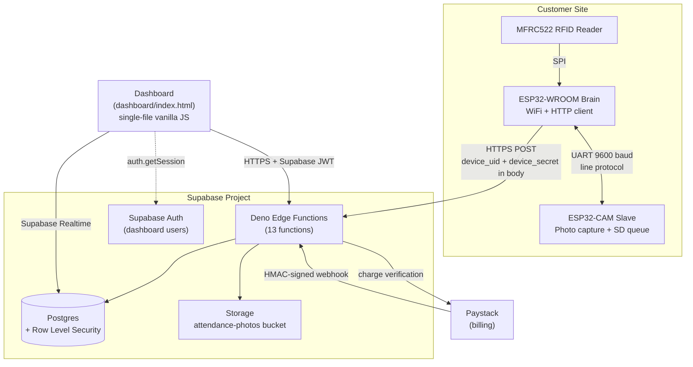
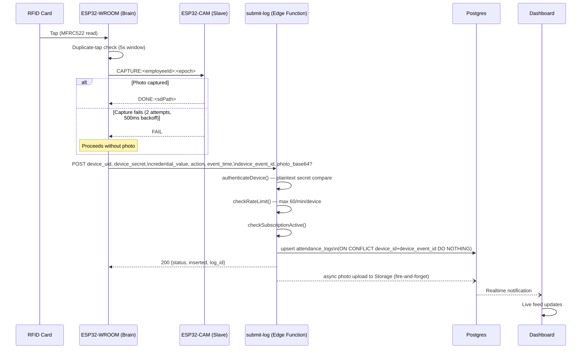

# Architecture

## System overview

Gateman is a multi-tenant SaaS attendance/presence-logging platform. Edge hardware (two ESP32 boards per site) reads RFID cards and captures a photo per event, syncing to a shared Supabase backend that serves a web dashboard to many organizations. There is no physical access control (no relay/lock/door-strike) — despite the product's framing, v1.0.0 is a logger, not a door system. See [`FIRMWARE.md`](FIRMWARE.md) for the hardware-level detail behind this document.

## Why this shape

- **Two-board firmware split**: the ESP32-CAM's GPIO layout conflicts with the pins the RFID reader (SPI) and a stable WiFi radio would want simultaneously; splitting camera and networking/RFID across two boards sidesteps that rather than fighting it on one chip. The tradeoff is a second physical board and an informal UART protocol between them — documented in [`FIRMWARE.md`](FIRMWARE.md), and a candidate for consolidation in [`V2 planning`](ROADMAP.md).
- **Supabase over a custom backend**: gets Postgres, RLS, Auth, Storage, Realtime, and Edge Functions without operating any of that infrastructure — reasonable for a solo-maintained product. The repo's own history shows an earlier Node.js/Express/SQLite backend that was fully replaced by this Supabase architecture (see [`LESSONS_LEARNED.md`](LESSONS_LEARNED.md)); no trace of the old backend remains in the current codebase.
- **Single-file dashboard**: no build step, no framework, no bundler — trivial to deploy (it's served as a static file by Caddy on the VPS, see [`DEPLOYMENT.md`](DEPLOYMENT.md)) at the cost of no component structure or type safety as the UI grows. Documented as a real tradeoff in [`DESIGN_DECISIONS.md`](DESIGN_DECISIONS.md), not silently accepted.
- **Device auth lives in the request body, not the transport layer**: firmware sends `apikey`/`Authorization: Bearer <anon key>` purely to satisfy the Supabase Edge Function gateway (which requires *some* valid Supabase JWT structurally); the actual per-device identity check is `device_uid` + `device_secret` compared inside the function body against the `devices` table. See [`SECURITY.md`](SECURITY.md) for the implications of this design (currently plaintext secret comparison, a deliberately deferred hardening item).

## Data flow: a single attendance event

Idempotency (`UNIQUE(device_id, device_event_id)` + `ON CONFLICT DO NOTHING`) means the firmware can safely retry a sync without creating duplicate records — this was a fixed bug relative to an earlier design; see [`DATABASE.md`](DATABASE.md) migration history.

## Provisioning flow

Covered in full in [`PROVISIONING.md`](PROVISIONING.md); summarized here for architectural context. An admin generates a single-use, 10-minute token from the dashboard (now correctly authenticated — see [`SECURITY.md`](SECURITY.md)); the device's captive portal collects WiFi credentials plus that token and calls `device-provision`, which validates the token, checks the org's device limit against its subscription plan, creates the `devices` row, and returns a plaintext `device_secret` exactly once.

## Multi-tenancy model

Every tenant-scoped table carries `organization_id`, enforced by RLS policies that check `org_members` for `auth.uid()`. Role model is `owner` / `admin` / `viewer` (`org_members.role`). Subscription tiers (`starter` / `growth` / `enterprise`) gate device count, user count, and data retention via the `subscriptions` table — see [`DATABASE.md`](DATABASE.md) for the full schema and [`BUSINESS_MODEL.md`](BUSINESS_MODEL.md) for how this maps to pricing.

## Deployment topology

Production runs on a single Hetzner VPS behind Caddy (auto-TLS), serving the dashboard as static files — no PM2 process, no Node server for Gateman itself (two unrelated projects on the same box do use PM2). Full detail, including the incident history that produced the current hardening posture, is in [`DEPLOYMENT.md`](DEPLOYMENT.md).

## What this document intentionally does not cover

Firmware internals → [`FIRMWARE.md`](FIRMWARE.md). Hardware/wiring → [`HARDWARE.md`](HARDWARE.md). Schema detail → [`DATABASE.md`](DATABASE.md). Per-endpoint contracts → [`API.md`](API.md) and [`EDGE_FUNCTIONS.md`](EDGE_FUNCTIONS.md). Threat model and fix history → [`SECURITY.md`](SECURITY.md).
