# Gateman — Database Reference

Backend: Supabase (Postgres + Row Level Security + Storage). This document describes the schema as defined by `supabase/migrations/*.sql`, plus two root-level SQL scripts (`storage_policies.sql`, and the historical `smart_attendance_view.sql` / `FIX_ATTENDANCE_SQL.sql`) that are applied manually via the Supabase SQL Editor and are not tracked as numbered migrations.

For the "why" behind the security-relevant fixes referenced here (RPC membership checks, plaintext device secrets), see `docs/SECURITY.md`. For deployment/runtime architecture, see `docs/ARCHITECTURE.md`.

## Contents

- [Entity-Relationship Diagram](#entity-relationship-diagram)
- [Table Reference](#table-reference)
- [Row Level Security](#row-level-security)
- [Triggers](#triggers)
- [Database Functions (RPCs)](#database-functions-rpcs)
- [Storage](#storage)
- [Migration History](#migration-history)

---

## Entity-Relationship Diagram

The core schema is 11 tables, all defined in `supabase/migrations/001_complete_schema.sql`. `auth.users` is Supabase's managed authentication table (outside the `public` schema) and is included only to show the foreign keys that reference it.

```mermaid
erDiagram
    AUTH_USERS ||--o{ ORG_MEMBERS : "user_id"
    AUTH_USERS ||--o{ PROVISION_TOKENS : "created_by"

    ORGANIZATIONS ||--o{ ORG_MEMBERS : "organization_id"
    ORGANIZATIONS ||--o{ SUBSCRIPTIONS : "organization_id"
    ORGANIZATIONS ||--o{ DEVICES : "organization_id"
    ORGANIZATIONS ||--o{ PROVISION_TOKENS : "organization_id"
    ORGANIZATIONS ||--o{ USERS : "organization_id"
    ORGANIZATIONS ||--o{ USER_CREDENTIALS : "organization_id"
    ORGANIZATIONS ||--o{ ATTENDANCE_LOGS : "organization_id"
    ORGANIZATIONS ||--o{ ENROLLMENT_QUEUE : "organization_id"
    ORGANIZATIONS ||--o{ AUDIT_LOGS : "organization_id (nullable)"
    ORGANIZATIONS ||--o{ PAYMENT_REFERENCES : "organization_id (nullable)"

    DEVICES ||--o{ PROVISION_TOKENS : "used_by_device_id (nullable)"
    DEVICES ||--o{ ATTENDANCE_LOGS : "device_id (SET NULL on delete)"
    DEVICES ||--o{ ENROLLMENT_QUEUE : "device_id"

    USERS ||--o{ USER_CREDENTIALS : "user_id"
    USERS ||--o{ ATTENDANCE_LOGS : "user_id (SET NULL on delete)"
    USERS ||--o{ ENROLLMENT_QUEUE : "assigned_to (nullable)"

    ORGANIZATIONS {
        uuid id PK
        text name
        text slug UK
        jsonb settings
        timestamptz created_at
        timestamptz updated_at
    }
    ORG_MEMBERS {
        uuid id PK
        uuid organization_id FK
        uuid user_id FK
        text role "owner|admin|viewer"
        timestamptz created_at
    }
    SUBSCRIPTIONS {
        uuid id PK
        uuid organization_id FK
        text plan_type "starter|growth|enterprise"
        text status "active|past_due|cancelled|trial"
        int device_limit
        int user_limit
        int retention_days
        timestamptz trial_ends_at
        timestamptz current_period_start
        timestamptz current_period_end
        text paystack_reference
    }
    DEVICES {
        uuid id PK
        uuid organization_id FK
        text device_uid UK
        text device_secret "plaintext"
        text name
        text location
        text status "active|inactive|revoked"
        text firmware_version
        timestamptz last_seen
    }
    PROVISION_TOKENS {
        uuid id PK
        uuid organization_id FK
        text token UK
        text device_name
        timestamptz expires_at
        timestamptz used_at
        uuid used_by_device_id FK
        uuid created_by FK
    }
    USERS {
        uuid id PK
        uuid organization_id FK
        text employee_id "UK with org"
        text name
        text department
        text email
        boolean active
    }
    USER_CREDENTIALS {
        uuid id PK
        uuid user_id FK
        uuid organization_id FK
        text type "rfid|pin|fingerprint|face"
        text value "UK with org+type"
    }
    ATTENDANCE_LOGS {
        uuid id PK
        uuid organization_id FK
        uuid device_id FK
        uuid user_id FK
        text credential_value
        text action "check_in|check_out"
        text device_event_id "UK with device_id"
        timestamptz timestamp
        text photo_url
        timestamptz synced_at
    }
    ENROLLMENT_QUEUE {
        uuid id PK
        uuid organization_id FK
        uuid device_id FK
        text credential_type
        text credential_value "nullable"
        text photo_url
        text status "pending|assigned|rejected|waiting"
        uuid assigned_to FK
        timestamptz resolved_at
    }
    AUDIT_LOGS {
        uuid id PK
        uuid organization_id FK "nullable"
        text actor_type "user|device|system"
        text actor_id
        text action
        text resource_type
        text resource_id
        jsonb metadata
        text ip_address
    }
    PAYMENT_REFERENCES {
        uuid id PK
        text reference UK
        uuid organization_id FK "nullable"
        text event_type
    }
```



A twelfth table, `device_claims`, exists (added by `supabase/migrations/002_device_claims.sql`) but is deliberately excluded from the diagram above: it is only read/written by the dead-code functions `claim-device`, `poll-claim`, and `pair-device` (see `docs/EDGE_FUNCTIONS.md`), none of which are called by the dashboard or firmware. It is documented in the [Table Reference](#device_claims-legacy-unused) below for completeness.

---

## Table Reference

### `organizations`

Tenant root. One row per customer organization.

| Column | Type | Constraints |
|---|---|---|
| `id` | UUID | PK, `DEFAULT gen_random_uuid()` |
| `name` | TEXT | NOT NULL |
| `slug` | TEXT | NOT NULL, UNIQUE |
| `settings` | JSONB | `DEFAULT '{}'` |
| `created_at` | TIMESTAMPTZ | NOT NULL, `DEFAULT NOW()` |
| `updated_at` | TIMESTAMPTZ | NOT NULL, `DEFAULT NOW()`, auto-updated by `trg_organizations_updated` |

No indexes beyond the PK and the unique `slug` constraint.

### `org_members`

Join table linking Supabase Auth users (`auth.users`) to organizations, with a role.

| Column | Type | Constraints |
|---|---|---|
| `id` | UUID | PK |
| `organization_id` | UUID | NOT NULL, FK → `organizations(id)` ON DELETE CASCADE |
| `user_id` | UUID | NOT NULL, FK → `auth.users(id)` ON DELETE CASCADE |
| `role` | TEXT | NOT NULL, `DEFAULT 'viewer'`, CHECK IN (`owner`, `admin`, `viewer`) |
| `created_at` | TIMESTAMPTZ | NOT NULL, `DEFAULT NOW()` |

Constraints: `UNIQUE(organization_id, user_id)` — a user can only have one role per org.

Indexes: `idx_org_members_user(user_id)`, `idx_org_members_org(organization_id)`.

This table is the membership anchor for essentially every RLS policy and RPC guard in the schema.

### `subscriptions`

Billing/plan state per organization.

| Column | Type | Constraints |
|---|---|---|
| `id` | UUID | PK |
| `organization_id` | UUID | NOT NULL, FK → `organizations(id)` ON DELETE CASCADE |
| `plan_type` | TEXT | NOT NULL, CHECK IN (`starter`, `growth`, `enterprise`) |
| `status` | TEXT | NOT NULL, `DEFAULT 'active'`, CHECK IN (`active`, `past_due`, `cancelled`, `trial`) |
| `device_limit` | INTEGER | NOT NULL, `DEFAULT 1` |
| `user_limit` | INTEGER | NOT NULL, `DEFAULT 50` |
| `retention_days` | INTEGER | NOT NULL, `DEFAULT 180` |
| `trial_ends_at` | TIMESTAMPTZ | nullable |
| `current_period_start` | TIMESTAMPTZ | NOT NULL, `DEFAULT NOW()` |
| `current_period_end` | TIMESTAMPTZ | NOT NULL, `DEFAULT NOW() + 30 days` |
| `paystack_reference` | TEXT | nullable |
| `created_at` / `updated_at` | TIMESTAMPTZ | NOT NULL, `updated_at` auto-updated by `trg_subscriptions_updated` |

Indexes: `idx_sub_org_active` — a **unique partial index** on `organization_id WHERE status IN ('active', 'trial')`. This is the mechanism that guarantees at most one active-or-trial subscription per org at a time; historical (`cancelled`/`past_due`) rows are not constrained.

Plan limits by type (from `PLAN_CONFIG` in `supabase/functions/paystack-webhook/index.ts`):

| Plan | device_limit | user_limit | retention_days |
|---|---|---|---|
| `starter` | 1 | 50 | 180 |
| `growth` | 5 | 500 | 365 |
| `enterprise` | 999 | 99999 | 730 |

### `devices`

Physical RFID reader units (ESP32 firmware).

| Column | Type | Constraints |
|---|---|---|
| `id` | UUID | PK |
| `organization_id` | UUID | NOT NULL, FK → `organizations(id)` ON DELETE CASCADE |
| `device_uid` | TEXT | NOT NULL, UNIQUE |
| `device_secret` | TEXT | NOT NULL — **stored and compared as plaintext**, see note below |
| `name` | TEXT | NOT NULL, `DEFAULT 'New Device'` |
| `location` | TEXT | nullable |
| `status` | TEXT | NOT NULL, `DEFAULT 'active'`, CHECK IN (`active`, `inactive`, `revoked`) |
| `firmware_version` | TEXT | nullable |
| `last_seen` | TIMESTAMPTZ | nullable, updated on every successful device authentication |
| `created_at` / `updated_at` | TIMESTAMPTZ | `updated_at` auto-updated by `trg_devices_updated` |

Indexes: `idx_devices_org(organization_id)`, `idx_devices_uid(device_uid)`.

**Plaintext secret note:** `supabase/functions/_shared/auth.ts` authenticates devices with a direct string comparison, `deviceSecret === device.device_secret` (`authenticateDevice()`). There is no hashing. This is a known, deliberately-deferred item (post-v1.0). See `docs/SECURITY.md` and `docs/ROADMAP.md`.

### `provision_tokens`

Single-use tokens minted by the dashboard to authorize a device's first-boot provisioning call.

| Column | Type | Constraints |
|---|---|---|
| `id` | UUID | PK |
| `organization_id` | UUID | NOT NULL, FK → `organizations(id)` ON DELETE CASCADE |
| `token` | TEXT | NOT NULL, UNIQUE |
| `device_name` | TEXT | nullable |
| `expires_at` | TIMESTAMPTZ | NOT NULL, `DEFAULT NOW() + 10 minutes` |
| `used_at` | TIMESTAMPTZ | nullable — set exactly once, guarded by a conditional update to prevent a race |
| `used_by_device_id` | UUID | FK → `devices(id)`, nullable |
| `created_by` | UUID | NOT NULL, FK → `auth.users(id)` |
| `created_at` | TIMESTAMPTZ | NOT NULL, `DEFAULT NOW()` |

Indexes: `idx_provision_token(token) WHERE used_at IS NULL` — a partial index optimized for the hot lookup path (unused, unexpired tokens).

### `users`

Employees/staff enrolled within an organization (distinct from `auth.users`, which is dashboard login identities).

| Column | Type | Constraints |
|---|---|---|
| `id` | UUID | PK |
| `organization_id` | UUID | NOT NULL, FK → `organizations(id)` ON DELETE CASCADE |
| `employee_id` | TEXT | NOT NULL |
| `name` | TEXT | NOT NULL |
| `department` | TEXT | nullable |
| `email` | TEXT | nullable |
| `active` | BOOLEAN | NOT NULL, `DEFAULT TRUE` |
| `created_at` / `updated_at` | TIMESTAMPTZ | `updated_at` auto-updated by `trg_users_updated` |

Constraints: `UNIQUE(organization_id, employee_id)`.

Indexes: `idx_users_org(organization_id)`.

### `user_credentials`

RFID/PIN/biometric credentials bound to a `users` row, scoped to an organization.

| Column | Type | Constraints |
|---|---|---|
| `id` | UUID | PK |
| `user_id` | UUID | NOT NULL, FK → `users(id)` ON DELETE CASCADE |
| `organization_id` | UUID | NOT NULL, FK → `organizations(id)` ON DELETE CASCADE |
| `type` | TEXT | NOT NULL, CHECK IN (`rfid`, `pin`, `fingerprint`, `face`) |
| `value` | TEXT | NOT NULL |
| `created_at` | TIMESTAMPTZ | NOT NULL, `DEFAULT NOW()` |

Constraints: `UNIQUE(organization_id, type, value)` — the same credential value cannot be assigned twice within an org (this is what `device-enroll` relies on to detect "already assigned").

Indexes: `idx_credentials_user(user_id)`, `idx_credentials_org(organization_id)`, `idx_credentials_lookup(organization_id, type, value)` — this composite index backs the RFID lookup done on every `submit-log` call and the bulk sync in `get-users`.

Only `rfid` credentials are currently read/written by any Edge Function; `pin`/`fingerprint`/`face` are schema-level allowances with no current code path.

### `attendance_logs`

The core event table — one row per check-in/check-out tap.

| Column | Type | Constraints |
|---|---|---|
| `id` | UUID | PK |
| `organization_id` | UUID | NOT NULL, FK → `organizations(id)` ON DELETE CASCADE |
| `device_id` | UUID | FK → `devices(id)` ON DELETE **SET NULL** |
| `user_id` | UUID | FK → `users(id)` ON DELETE **SET NULL** |
| `credential_value` | TEXT | NOT NULL — raw credential presented, kept even if unresolved to a user |
| `action` | TEXT | NOT NULL, CHECK IN (`check_in`, `check_out`) |
| `device_event_id` | TEXT | NOT NULL — device-generated idempotency key |
| `timestamp` | TIMESTAMPTZ | NOT NULL — event time as reported by the device |
| `photo_url` | TEXT | nullable — Storage path in `attendance-photos` |
| `synced_at` | TIMESTAMPTZ | NOT NULL, `DEFAULT NOW()` — server receipt time |

Constraints: `UNIQUE(device_id, device_event_id)` — this is the idempotency mechanism. `submit-log` upserts on this pair with `ignoreDuplicates: true`, so a retried device event is a no-op rather than a duplicate row.

The `ON DELETE SET NULL` behavior on `device_id`/`user_id` (called out in a migration comment as a deliberate fix) means attendance history survives device or employee deletion rather than cascading away.

Indexes: `idx_logs_org(organization_id)`, `idx_logs_org_ts(organization_id, timestamp DESC)` (dashboard range queries), `idx_logs_device(device_id)`, `idx_logs_user(user_id)`, `idx_logs_event(device_id, device_event_id)`.

### `enrollment_queue`

Tracks the credential-enrollment workflow (both the legacy device-initiated flow and the current admin-initiated flow added in `002_admin_enrollment.sql`).

| Column | Type | Constraints |
|---|---|---|
| `id` | UUID | PK |
| `organization_id` | UUID | NOT NULL, FK → `organizations(id)` ON DELETE CASCADE |
| `device_id` | UUID | NOT NULL, FK → `devices(id)` |
| `credential_type` | TEXT | NOT NULL, `DEFAULT 'rfid'` |
| `credential_value` | TEXT | nullable (made nullable by `002_admin_enrollment.sql` — unknown until the employee taps their card) |
| `photo_url` | TEXT | nullable |
| `status` | TEXT | NOT NULL, `DEFAULT 'pending'`, CHECK IN (`pending`, `assigned`, `rejected`, `waiting`) — `waiting` added by `002_admin_enrollment.sql` |
| `assigned_to` | UUID | FK → `users(id)`, nullable |
| `created_at` | TIMESTAMPTZ | NOT NULL, `DEFAULT NOW()` |
| `resolved_at` | TIMESTAMPTZ | nullable |

Two enrollment flows share this table:
- **Legacy/device-initiated**: `device-enroll` inserts a `pending` row with a known `credential_value` when an unrecognized card is tapped; an admin later resolves it via the dashboard (assign/reject — not covered by any Edge Function in this repo, presumably a direct dashboard update against the `enrollment_update` RLS policy).
- **Admin-initiated** (current): `start-enrollment` inserts a `waiting` row (credential_value NULL, `assigned_to` pre-set to the target employee); the device polls `check-enrollment`, and when the employee taps a card, `device-enroll` (called with `enrollment_id`) fills in `credential_value`, writes `user_credentials`, and marks the row `assigned`.

Indexes: `idx_enrollment_org(organization_id) WHERE status = 'pending'`, `idx_enrollment_waiting(organization_id, device_id) WHERE status = 'waiting'`.

### `audit_logs`

Append-only audit trail. Written by nearly every Edge Function via `auditLog()` in `_shared/auth.ts` (fire-and-forget, never blocks the response).

| Column | Type | Constraints |
|---|---|---|
| `id` | UUID | PK |
| `organization_id` | UUID | FK → `organizations(id)` ON DELETE CASCADE, **nullable** (e.g. a failed device login before any org context is known) |
| `actor_type` | TEXT | NOT NULL, CHECK IN (`user`, `device`, `system`) |
| `actor_id` | TEXT | nullable |
| `action` | TEXT | NOT NULL — free-form event name, e.g. `attendance.submitted`, `device.provisioned`, `subscription.activated` |
| `resource_type` | TEXT | nullable |
| `resource_id` | TEXT | nullable |
| `metadata` | JSONB | `DEFAULT '{}'` |
| `ip_address` | TEXT | nullable |
| `created_at` | TIMESTAMPTZ | NOT NULL, `DEFAULT NOW()` |

Indexes: `idx_audit_org(organization_id, created_at DESC)`, `idx_audit_action(action)`.

**Immutable by design**: only a SELECT policy (`audit_select`) exists. There are no UPDATE or DELETE policies, and no authenticated-role INSERT policy — rows are only ever written by Edge Functions using the service-role key, which bypasses RLS entirely.

This table doubles as the storage for `checkRateLimit()` in `_shared/auth.ts`, which counts rows by `action` + `actor_id` within a time window (see [Row Level Security](#row-level-security) and `docs/EDGE_FUNCTIONS.md` for which functions use it).

### `payment_references`

Idempotency ledger for Paystack webhook processing.

| Column | Type | Constraints |
|---|---|---|
| `id` | UUID | PK |
| `reference` | TEXT | UNIQUE, NOT NULL |
| `organization_id` | UUID | FK → `organizations(id)` ON DELETE CASCADE, nullable |
| `event_type` | TEXT | NOT NULL |
| `created_at` | TIMESTAMPTZ | NOT NULL, `DEFAULT NOW()` |

No indexes beyond PK and the unique `reference` constraint (which is itself the idempotency check `paystack-webhook` performs before processing a `charge.success` event).

**No RLS policies of any kind are defined for this table** beyond `ENABLE ROW LEVEL SECURITY` — meaning it is unreachable by both `anon` and `authenticated` roles. Only the service-role key (used internally by `paystack-webhook`) can read or write it.

### `device_claims` (legacy, unused)

Added by `supabase/migrations/002_device_claims.sql` for an auto-discovery pairing flow. Not part of the core 11-table model and not referenced by any live code path — only by the dead-code functions `claim-device`, `poll-claim`, and `pair-device` (see `docs/EDGE_FUNCTIONS.md`).

| Column | Type | Constraints |
|---|---|---|
| `id` | UUID | PK |
| `device_mac` | TEXT | NOT NULL |
| `organization_id` | UUID | NOT NULL, FK → `organizations(id)` ON DELETE CASCADE |
| `provision_token` | TEXT | NOT NULL |
| `wifi_ssid` | TEXT | NOT NULL |
| `wifi_password` | TEXT | NOT NULL — stored in plaintext |
| `claimed_by` | UUID | FK → `auth.users(id)` ON DELETE SET NULL |
| `claimed` | BOOLEAN | `DEFAULT FALSE` |
| `expires_at` | TIMESTAMPTZ | NOT NULL |
| `created_at` / `updated_at` | TIMESTAMPTZ | `DEFAULT now()` |

Indexes: `idx_device_claims_mac(device_mac) WHERE NOT claimed`, `idx_device_claims_expires(expires_at) WHERE NOT claimed`.

RLS: a single `"Service role full access"` policy (`FOR ALL TO service_role`) — no policy grants access to `authenticated` or `anon`.

The migration also defines `cleanup_expired_claims()` (SECURITY DEFINER, deletes expired unclaimed rows), but the `pg_cron` schedule to invoke it is commented out in the migration and not enabled anywhere in this repo — expired rows are never automatically purged.

---

## Row Level Security

RLS is enabled on all 11 core tables (plus `device_claims`). The dominant pattern, used for every `SELECT` policy, is an `organization_id IN (...)` subquery against `org_members` for `auth.uid()`:

```sql
organization_id IN (SELECT organization_id FROM org_members WHERE user_id = auth.uid())
```

Mutation policies (`INSERT`/`UPDATE`) narrow this further to `role IN ('owner', 'admin')`. No table has a client-facing `DELETE` policy — row removal only happens via `ON DELETE CASCADE`/`SET NULL` at the foreign-key level, or not at all.

Full policy list (from `001_complete_schema.sql` and `002_admin_enrollment.sql`):

| Table | Policy | Command | Rule |
|---|---|---|---|
| `organizations` | `org_select` | SELECT | member of the org |
| `organizations` | `org_insert` | INSERT | any authenticated user (signup flow) |
| `org_members` | `members_select` | SELECT | member of the org |
| `org_members` | `members_self_insert` | INSERT | `user_id = auth.uid() AND role = 'owner'` (signup, self-provisioning as owner) |
| `org_members` | `members_insert` | INSERT | caller is owner/admin of the target org |
| `subscriptions` | `sub_select` | SELECT | member of the org |
| `devices` | `devices_select` | SELECT | member of the org |
| `devices` | `devices_insert` | INSERT | caller is owner/admin |
| `provision_tokens` | `tokens_select` | SELECT | member of the org |
| `provision_tokens` | `tokens_insert` | INSERT | caller is owner/admin |
| `users` | `users_select` | SELECT | member of the org |
| `users` | `users_insert` | INSERT | caller is owner/admin |
| `users` | `users_update` | UPDATE | caller is owner/admin |
| `user_credentials` | `credentials_select` | SELECT | member of the org |
| `user_credentials` | `credentials_insert` | INSERT | caller is owner/admin |
| `attendance_logs` | `logs_select` | SELECT | member of the org (no client INSERT policy — writes are service-role only, via `submit-log`) |
| `enrollment_queue` | `enrollment_select` | SELECT | member of the org |
| `enrollment_queue` | `enrollment_update` | UPDATE | caller is owner/admin |
| `enrollment_queue` | `enrollment_insert` (002) | INSERT | caller is owner/admin (added for the admin-initiated `waiting` flow) |
| `audit_logs` | `audit_select` | SELECT | caller is owner/admin (no INSERT/UPDATE/DELETE policy — immutable, service-role writes only) |
| `payment_references` | *(none)* | — | no client access whatsoever; service-role only |
| `device_claims` | `Service role full access` | ALL | `TO service_role` only |

Device-facing writes (`attendance_logs`, `devices.last_seen`, `user_credentials`, `enrollment_queue` inserts from `device-enroll`) all happen through Edge Functions using the **service-role key**, which bypasses RLS entirely — device identity is enforced in application code (`authenticateDevice()`), not by a Postgres role tied to `device_uid`.

---

## Triggers

| Trigger | Table | Timing | Function | Behavior |
|---|---|---|---|---|
| `on_org_created` | `organizations` | AFTER INSERT | `handle_new_organization()` | Inserts a starter-plan `trial` subscription row: `device_limit=1, user_limit=50, retention_days=180, trial_ends_at=NOW()+14 days`. SECURITY DEFINER. |
| `trg_organizations_updated` | `organizations` | BEFORE UPDATE | `update_updated_at()` | Sets `NEW.updated_at = NOW()`. |
| `trg_devices_updated` | `devices` | BEFORE UPDATE | `update_updated_at()` | Same. |
| `trg_users_updated` | `users` | BEFORE UPDATE | `update_updated_at()` | Same. |
| `trg_subscriptions_updated` | `subscriptions` | BEFORE UPDATE | `update_updated_at()` | Same. |

Note that `org_members`, `provision_tokens`, `user_credentials`, `attendance_logs`, `enrollment_queue`, `audit_logs`, and `payment_references` do not have an `updated_at` column at all, so no trigger is needed or present for them.

---

## Database Functions (RPCs)

Five RPCs back the dashboard's read-only analytics/reporting views. All five are `SECURITY DEFINER` `plpgsql` functions and, as of the current migrations, **all five now begin with an identical membership guard**:

```sql
IF NOT EXISTS (
  SELECT 1 FROM public.org_members WHERE user_id = auth.uid() AND organization_id = org_id
) THEN
  RAISE EXCEPTION 'access_denied';
END IF;
```

This is significant for `get_smart_attendance` specifically: it did **not** have this check prior to `004_secure_smart_attendance.sql` (see [Migration History](#migration-history)) — any authenticated user could previously pass an arbitrary `org_id` and read another tenant's attendance history. That gap is closed as of the current schema. See `docs/SECURITY.md` for the full narrative.

| Function | Signature | Returns | Purpose |
|---|---|---|---|
| `get_hourly_stats` | `(org_id UUID)` | `TABLE(hour TEXT, action TEXT, count BIGINT)` | Check-in/check-out counts grouped by hour-of-day (`HH24`), for `CURRENT_DATE` only. Powers the dashboard's intraday activity chart. |
| `get_weekly_stats` | `(org_id UUID)` | `TABLE(date DATE, unique_staff BIGINT, total_taps BIGINT)` | Daily unique-staff and total-tap counts for the trailing 7 days. |
| `get_department_presence` | `(org_id UUID)` | `TABLE(department TEXT, present BIGINT)` | Count of distinct users with a `check_in` today, grouped by `users.department`. |
| `get_dashboard_stats` | `(org_id UUID)` | `JSON` | Single-call summary object: `total_employees` (active users), `today_records`, `checked_in` (users checked in today without a later check-out today), `devices` (active device count). |
| `get_smart_attendance` | `(org_id UUID, from_date TIMESTAMPTZ DEFAULT NULL, to_date TIMESTAMPTZ DEFAULT NULL)` | `TABLE(user_id, employee_id, name, department, date, check_in_time, check_out_time, check_in_device, check_out_device, check_in_photo, check_out_photo, hours_worked NUMERIC)` | First-check-in / last-check-out per user per day, computed via a `FULL OUTER JOIN` of a first-check-in subquery and a last-check-out subquery (so a day with only a check-in or only a check-out still produces a row). `hours_worked` is `NULL` unless both sides are present. Optional `from_date`/`to_date` bound the underlying `attendance_logs` scan. |

None of the first four RPCs have an explicit `GRANT EXECUTE` statement in `001_complete_schema.sql`; `get_smart_attendance` does (`GRANT EXECUTE ... TO authenticated;`, present in `004_secure_smart_attendance.sql` and the superseded `smart_attendance_view.sql`/`FIX_ATTENDANCE_SQL.sql`). In Postgres, `EXECUTE` is granted to `PUBLIC` by default at function-creation time unless explicitly revoked, so all five are callable by any authenticated (or anon) role — the membership `RAISE EXCEPTION` inside the function body is the actual authorization boundary, not the grant.

---

## Storage

One Supabase Storage bucket, `attendance-photos`, configured manually (not via a tracked migration — see `storage_policies.sql`):

- **Public**: off
- **File size limit**: 50KB (sized for QQVGA JPEG captures from the ESP32-CAM)
- **Allowed MIME types**: `image/jpeg`

Bucket policies (`storage.objects`, scoped to `bucket_id = 'attendance-photos'`):

| Policy | Command | Role |
|---|---|---|
| "Service role can upload photos" | INSERT | `service_role` |
| "Service role can update photos" | UPDATE | `service_role` |
| "Service role can view photos" | SELECT | `service_role` |
| "Authenticated users can view photos" | SELECT | `authenticated` |

There is no `authenticated` INSERT/UPDATE policy — all photo uploads happen server-side (via `submit-log` and `device-enroll`, both using the service-role key), never directly from a device or the dashboard client. Object paths follow `{organization_id}/{device_id}/{log_id}.jpg` (attendance) or `{organization_id}/{device_id}/enrollments/{enrollment_id}.jpg` (enrollment).

---

## Migration History

Applied in this order:

1. **`001_complete_schema.sql`** — the full base schema: all 11 core tables, indexes, RLS policies, the two triggers, and the original four RPCs (`get_hourly_stats`, `get_weekly_stats`, `get_department_presence`, `get_dashboard_stats`), all already membership-guarded at introduction.
2. **`002_admin_enrollment.sql`** — adds the `waiting` status to `enrollment_queue`, makes `credential_value` nullable, adds the `enrollment_insert` RLS policy, and adds `idx_enrollment_waiting`. Supports the admin-initiated enrollment flow (`start-enrollment` + `check-enrollment` + `device-enroll`).
3. **`002_device_claims.sql`** — adds the `device_claims` table for an auto-discovery pairing flow. **Note:** this migration is also numbered `002`, duplicating `002_admin_enrollment.sql`. Both are present in the repo and (presumably) both were applied; this is a known numbering gap in the migration sequence, not a semantic conflict — they touch disjoint tables.
4. **`003_fix_smart_attendance.sql`** — introduces `get_smart_attendance` as a standalone RPC (fixing an ambiguous-column bug in an earlier ad hoc version), using a `first_in`/`last_out` CTE approach. Superseded by `004`.
5. **`004_secure_smart_attendance.sql`** — **current, authoritative** definition of `get_smart_attendance`. Rewrites the query as a `FULL OUTER JOIN` of separate check-in/check-out subqueries (correctly handling a day with only one of the two events, which the `003` CTE version did not), and — the substantive change — adds the `org_members` membership guard described in [Database Functions](#database-functions-rpcs), closing a cross-tenant data leak. See `docs/SECURITY.md`.

Two root-level scripts predate/parallel the migrations directory and are not applied via `supabase/migrations`:

- **`smart_attendance_view.sql`** and **`FIX_ATTENDANCE_SQL.sql`** — earlier iterations of `get_smart_attendance` (the latter contributed the `FULL OUTER JOIN` shape that `004` incorporates). Both lack the membership guard. Superseded by `004_secure_smart_attendance.sql`; do not run them against a database that already has `004` applied.
- **`storage_policies.sql`** — the `attendance-photos` bucket policies documented in [Storage](#storage) above. Bucket creation itself (name, size limit, MIME allowlist) is a manual Supabase Dashboard step per the comment block at the end of `001_complete_schema.sql`.
