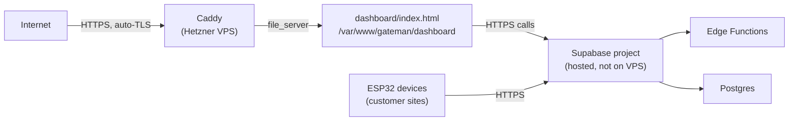

# Deployment

## Production topology (current, verified against `VPS_RECOVERY_GUIDE.md`)

Gateman's dashboard and backend are split across two providers:

- **Dashboard**: static files served directly by **Caddy** (`file_server` directive) on a Hetzner CAX11 ARM64 VPS running Ubuntu 24.04. There is **no PM2 process, no Node.js server, and no build step** for the dashboard — it is `dashboard/index.html` and nothing else, deployed by `git pull` on the server. (Two other, unrelated projects on the same VPS — `upjobs.co`, `liveportfolio.site` — do run under PM2; Gateman does not, and should not be confused with them when reading server-wide notes.)
- **Backend**: Supabase-hosted (Postgres, Auth, Storage, Edge Functions, Realtime) — not self-hosted, not on the VPS at all. Deployed independently via the Supabase CLI.



## ⚠️ Known documentation conflict — this file is authoritative

Two other documents in this repository describe **different, incompatible** deployment models for the dashboard:

| Source | Web root | Server | Status |
|---|---|---|---|
| `VPS_RECOVERY_GUIDE.md` (this file's source) | `/var/www/gateman/dashboard/` | Caddy `file_server` | **Current — verified via the actual Caddyfile in that document, dated 2026-06-03** |
| `deployment_guide.md` (`docs/`) | `/var/www/ecotronics/` or `/var/www/html/` | Nginx, or `http-server` under PM2 | Stale — describes an earlier deployment approach |
| `WIKI.md` §8.3 | (implies PM2-managed) | `pm2 restart gateman-dashboard` | Stale — no such PM2 process exists per the Caddyfile |

`deployment_guide.md` and the relevant section of `WIKI.md` are flagged for archival in [`CLEANUP_REPORT.md`](CLEANUP_REPORT.md). Do not follow their instructions.

## Deploying a dashboard change

```bash
# On the VPS, as the deploy user:
cd /var/www/gateman
git pull
# No restart needed — Caddy serves the file directly, no process to reload.
```

## Deploying a backend (Edge Function) change

```bash
npx supabase functions deploy <function-name> --project-ref ueobebsgheecclwcbigy
```

`deploy-functions.bat` (repo root) / `deploy_quick_commands.md` (`docs/`) automate this for 10 of the 13 functions — `device-provision`, `device-login`, `submit-log`, `get-users`, `create-provision-token`, `device-enroll`, `create-checkout`, `paystack-webhook`, `start-enrollment`, `check-enrollment`. It's missing `claim-device`, `pair-device`, `poll-claim` — three of the four orphaned functions from abandoned provisioning experiments (see [`PROVISIONING.md`](PROVISIONING.md)). Note `device-login` **is** in the deploy script despite also being unused by any current client — being deployable and being called are two different facts; don't conflate "not in this script" with "not live." None of the deployed functions use the `--no-verify-jwt` flag; the Supabase gateway requires a structurally valid JWT on every call (satisfied by the public anon key for device-facing functions, and by a real user session for dashboard-facing ones — see [`SECURITY.md`](SECURITY.md) for why that gateway-level check alone was insufficient for three functions).

## Deploying a schema/migration change

```bash
npx supabase db push
# or paste the migration file directly into Supabase Dashboard → SQL Editor
```

## Server hardening posture

`VPS_RECOVERY_GUIDE.md` documents that the *previous* VPS was compromised, with the suspected root cause being a weak/exposed root password, permissive SSH configuration, and a dev-default secret left in place. The current guide is written defensively as a result, and includes a hardening checklist (non-default SSH port, fail2ban, UFW, Cloudflare, AIDE, rkhunter, auditd, sysctl hardening, a secret-rotation cadence) and a daily cron backup of env files, the Caddyfile, and the crontab itself. That document also records that real `.env` secrets were pasted into an AI chat session during the incident response and flagged for rotation — worth confirming that rotation was actually completed if it hasn't been verified since.

## Rollback

- **Dashboard**: `git log` on the VPS checkout, `git checkout <previous-commit> -- dashboard/index.html`, no restart needed.
- **Edge Function**: `git checkout <previous-commit> -- supabase/functions/<name>/index.ts` locally, redeploy.
- **Migration**: migrations here are `CREATE OR REPLACE FUNCTION` statements, not destructive schema changes — rollback means re-running the prior version's SQL, not a down-migration. There is currently no automated down-migration tooling in this repo; treat each migration file as forward-only and roll back by hand if needed.

## What this document does not cover

Server provisioning from scratch (OS install, initial hardening, DNS) is covered in full detail in [`VPS_RECOVERY_GUIDE.md`](VPS_RECOVERY_GUIDE.md) — that document is long, incident-driven, and intentionally left in place rather than duplicated here.


Remaining manual work
Deploy: migration 004_secure_smart_attendance.sql, redeploy create-provision-token and start-enrollment (now carries the rate-limit change too), push dashboard/index.html. I have no authenticated Supabase/VPS access — this is on you.
Run the hardware acceptance test.
Decide which CLEANUP_REPORT.md rows to act on (note: WIKI.md and plan.md need a diff-before-delete pass, not a blanket removal).
Pick a license (flagged, not chosen, in README.md).
Personalize the "Why I Built It" README section — I left it as an explicit placeholder rather than inventing your motivation.
Confirm whether prior .env secret rotation (flagged in VPS_RECOVERY_GUIDE.md) actually happened.