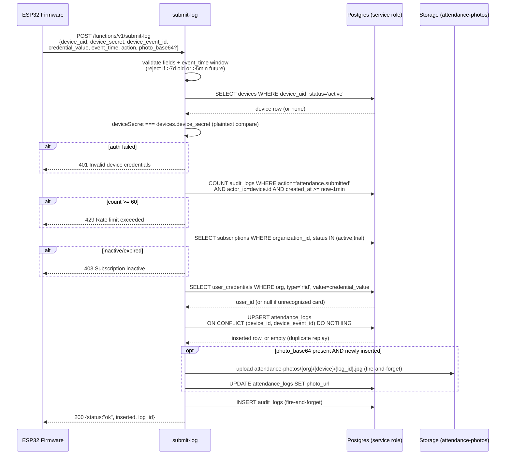
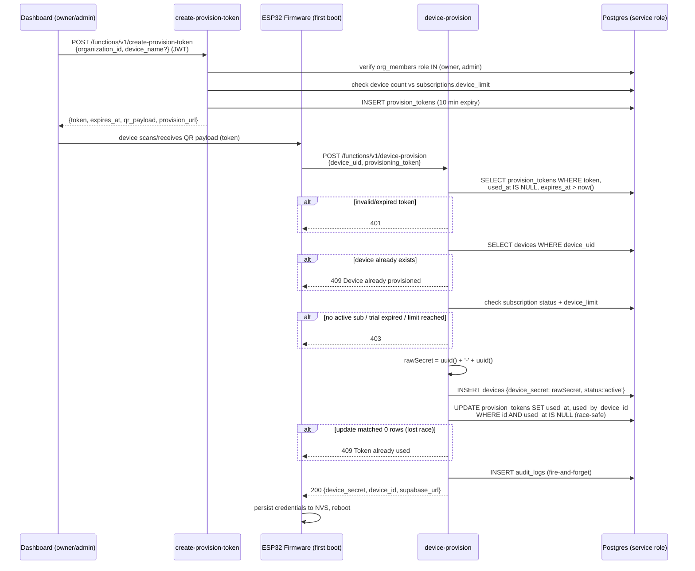

# Gateman — Edge Functions Reference

13 Supabase Edge Functions (Deno, `supabase/functions/*/index.ts`), plus two shared modules:

- `supabase/functions/_shared/auth.ts` — `getSupabaseAdmin()` (service-role client), `authenticateDevice()`, `checkSubscriptionActive()`, `auditLog()`, `checkRateLimit()`.
- `supabase/functions/_shared/cors.ts` — `corsHeaders`, `handleCors()`, `jsonResponse()`, `errorResponse()`.

Status is determined by grepping actual call sites, not by reading each function's own doc comments:

- **Firmware call sites**: `firmware/wroom_brain/wroom_brain.ino` calls `device-provision`, `submit-log`, `device-enroll`, `check-enrollment`, `get-users`.
- **Dashboard call sites**: `dashboard/index.html` calls `start-enrollment` and `create-provision-token` (both confirmed via `functions/v1/...` fetch URLs in that file). `create-checkout` is written to the same JWT-authenticated pattern and is clearly intended as a dashboard endpoint, but **no call site for it was found in `dashboard/index.html`** — `TODO: Needs verification` whether it is invoked from elsewhere (a billing page not present in this file, a separate client, etc.) or is presently unused.
- **No call site found in either firmware or dashboard**: `device-login`, `pair-device`, `claim-device`, `poll-claim`.
- **External caller**: `paystack-webhook` is invoked by Paystack's servers, verified via HMAC-SHA512 signature.

For the database side of every claim below (RLS, RPCs, table shapes), see `docs/DATABASE.md`. For the "why" of the JWT/membership checks on `create-provision-token`/`start-enrollment` and the plaintext device secret, see `docs/SECURITY.md`.

## Summary

| Function | Status | Auth | Rate limited |
|---|---|---|---|
| `device-provision` | live — firmware | token in body (`provisioning_token`) | no |
| `submit-log` | live — firmware | `device_uid`+`device_secret` in body | yes (60/min/device) |
| `get-users` | live — firmware | `device_uid`+`device_secret` in body | no |
| `device-enroll` | live — firmware | `device_uid`+`device_secret` in body | no |
| `check-enrollment` | live — firmware | `device_uid`+`device_secret` in body | no |
| `create-provision-token` | live — dashboard | Supabase JWT + org membership (owner/admin) | yes (10 tokens/org/10min) |
| `start-enrollment` | live — dashboard | Supabase JWT + org membership (owner/admin) | yes (20/org/5min) |
| `create-checkout` | dashboard-pattern, call site unverified | Supabase JWT + org membership (owner/admin) | no |
| `paystack-webhook` | live — external webhook | HMAC-SHA512 signature + Paystack re-verification | no |
| `device-login` | unused | `device_uid`+`device_secret` in body | yes (5 failed/5min) |
| `pair-device` | unused, and would error if invoked | Supabase JWT | no |
| `claim-device` | unused | Supabase JWT | no |
| `poll-claim` | unused | none | no |

---

## Live — Firmware-Facing

All five functions in this group authenticate via `authenticateDevice(supabase, device_uid, device_secret)` in `_shared/auth.ts`: a lookup of `devices` by `device_uid` + `status = 'active'`, followed by a plaintext equality check against `devices.device_secret`. On success, `last_seen` is updated fire-and-forget. All use the service-role client (`getSupabaseAdmin()`), so they bypass RLS entirely and enforce tenant scoping themselves via `device.organization_id`.

### `device-provision`

**Purpose**: First-boot handshake. Exchanges a single-use `provision_tokens` row for a permanent device identity.

**Auth**: none at the HTTP layer (no device credentials exist yet) — authorization is the possession of a valid, unexpired, unused `provisioning_token`.

**Request**: `{ device_uid: string, provisioning_token: string }`

**Response** (200): `{ device_secret: string, device_id: string, supabase_url: string }` — this is the **only time** the plaintext `device_secret` is ever returned to the device; it's generated as `crypto.randomUUID() + '-' + crypto.randomUUID()` and stored as-is (no hashing).

**Behavior**:
- Validates the token is unused and unexpired.
- Rejects if a device with that `device_uid` already exists (409).
- Checks the org's subscription (`status IN ('active','trial')`, trial not expired) and current device count against `subscriptions.device_limit` (403 if no active sub / trial expired / limit reached).
- Marks the token used via a **conditional update** (`.eq('used_at', null)`) after the insert, so two concurrent provisioning attempts with the same token can't both succeed — the loser gets 409 "Token already used".
- Writes an `audit_logs` row (`device.provisioned`) fire-and-forget.

### `submit-log`

**Purpose**: Per-event attendance sync — the primary write path for `attendance_logs`.

**Auth**: `device_uid` + `device_secret` in body.

**Request**:
```json
{
  "device_uid": "string",
  "device_secret": "string",
  "device_event_id": "string",
  "credential_value": "string",
  "event_time": "ISO 8601 string",
  "action": "check_in | check_out",
  "photo_base64": "string (optional)",
  "photo_mime": "string (optional, default image/jpeg)"
}
```

**Response** (200): `{ status: "ok", inserted: boolean, log_id: string | null }` — `inserted: false` on a duplicate `device_event_id` (idempotent replay), not an error.

**Behavior**:
- Rejects `event_time` more than 7 days in the past or more than 5 minutes in the future (422).
- **Rate limited**: max 60 submissions per device per minute, enforced via `checkRateLimit()` counting `audit_logs` rows with `action='attendance.submitted'`, `actor_id=<device.id>` in the trailing 1 minute (429 if exceeded).
- Checks subscription is active/trial (403 otherwise).
- Resolves `credential_value` → `user_id` via `user_credentials` (org+type=rfid scoped); an unrecognized card still produces a log row with `user_id = null`.
- Inserts via `.upsert(..., { onConflict: 'device_id,device_event_id', ignoreDuplicates: true })` — the idempotency mechanism described in `docs/DATABASE.md`.
- If `photo_base64` is present and the row was newly inserted, uploads to `attendance-photos/{org}/{device}/{log_id}.jpg` **fire-and-forget** (does not block the HTTP response) and then patches `photo_url` onto the row.

### `get-users`

**Purpose**: Bulk sync of the org's active employee roster + RFID credentials, for the device's local cache.

**Auth**: `device_uid` + `device_secret` in body.

**Request**: `{ device_uid: string, device_secret: string }`

**Response** (200): `{ users: [{ user_id, name, employee_id, department, rfid_uid }], device_id: string }` — only users that have an assigned RFID credential are included (the code filters `rfidMap.has(u.id)`); active users with no RFID credential yet are silently omitted.

**Behavior**: checks subscription is active/trial before returning data (403 otherwise). No rate limiting.

### `device-enroll`

**Purpose**: Registers a new RFID credential, either device-initiated (legacy) or admin-initiated (current — see `start-enrollment`/`check-enrollment` below).

**Auth**: `device_uid` + `device_secret` in body.

**Request**:
```json
{
  "device_uid": "string",
  "device_secret": "string",
  "credential_value": "string",
  "credential_type": "string (optional, default rfid)",
  "photo_base64": "string (optional)",
  "enrollment_id": "string (optional — UUID of a waiting enrollment_queue row)"
}
```

**Response** (200), one of:
- `{ status: "already_assigned", credential_value }` — credential already exists in `user_credentials` for this org.
- `{ status: "enrolled", enrollment_id, credential_value, assigned_to }` — admin-initiated path completed: `enrollment_id` supplied, matching `waiting` row found, `user_credentials` row inserted, `enrollment_queue` row updated to `assigned`.
- `{ status: "already_pending", enrollment_id }` — legacy path, credential already queued.
- `{ status: "ok", enrollment_id }` — legacy path, new `pending` row created in `enrollment_queue` (optionally with an uploaded photo at `attendance-photos/{org}/{device}/enrollments/{enrollment_id}.jpg`).

**Status codes**: 400 (missing fields), 401 (bad device credentials), 404 (`enrollment_id` given but no matching `waiting` row), 403 (`enrollment_id`'s `organization_id` doesn't match the authenticated device's org), 500 (insert failures), 200.

### `check-enrollment`

**Purpose**: Device polls this to discover whether an admin has queued a `waiting` enrollment for it (the admin-initiated flow).

**Auth**: `device_uid` + `device_secret` in body.

**Request**: `{ device_uid: string, device_secret: string }`

**Response** (200): `{ enroll: false }`, or `{ enroll: true, enrollment_id, assigned_to, credential_type }` if a `waiting` row exists for this org+device (most recent one, via `.order('created_at', {ascending:false}).limit(1)`).

No rate limiting, no subscription check.

---

## Live — Dashboard-Facing

Both functions below share an identical auth pattern (per an explicit code comment in `create-provision-token`, this mirrors `create-checkout`'s pre-existing pattern): validate the caller's Supabase session JWT via `supabase.auth.getUser()` on an anon-key client constructed from the request's `Authorization` header, then look up `org_members` for that `user.id` + the request's `organization_id` and require `role IN ('owner', 'admin')`. This membership check is what was added/fixed in the current version of these functions — see `docs/SECURITY.md`.

### `create-provision-token`

**Purpose**: Dashboard admin mints a single-use provisioning token for a new device.

**Auth**: `Authorization: Bearer <supabase_session_access_token>` + `apikey`. Caller must be `owner`/`admin` of `organization_id`.

**Request**: `{ organization_id: string, device_name?: string }`

**Response** (200): `{ token: string, expires_at: string, qr_payload: string, provision_url: string }` — `qr_payload` is `JSON.stringify({ token, url: SUPABASE_URL })`, encoded into a QR code by the dashboard for the device to scan (or hand-enter) during provisioning.

**Status codes**: 401 (missing/invalid auth), 400 (missing `organization_id`), 403 (not owner/admin, no active subscription, trial expired, or device limit reached), 429 (rate limited), 500, 200.

**Behavior**: token is 32 hex chars from `crypto.getRandomValues`, 10-minute expiry, checks device count against `subscriptions.device_limit` before issuing. Writes `provision_token.created` to `audit_logs`. Rate limited to 10 tokens per org per 10 minutes via `checkRateLimit()`, added as a Phase 4 reliability improvement (the helper was already imported but unused prior to that).

### `start-enrollment`

**Purpose**: Admin initiates card enrollment for a specific employee on a specific device (the current, preferred enrollment UX — supersedes the legacy device-initiated flow in `device-enroll`).

**Auth**: `Authorization: Bearer <supabase_session_access_token>`. Caller must be `owner`/`admin` of `organization_id`.

**Request**: `{ user_id: string, device_id: string, organization_id: string }`

**Response** (200): `{ status: "waiting", enrollment_id: string }`

**Behavior**: verifies the target device belongs to the org and is `active` (404 if not); cancels (`rejected`) any prior `waiting` row for the same org+device before inserting the new one, so only one enrollment can be in flight per device at a time; inserts `enrollment_queue` with `status='waiting'`, `credential_value=null`, `assigned_to=user_id`. Writes `enrollment.initiated` to `audit_logs`. Rate limited to 20 enrollment starts per org per 5 minutes (Phase 4 addition).

**Status codes**: 401, 400 (missing fields), 403 (not owner/admin), 404 (device not found/inactive), 429 (rate limited), 500, 200.

---

## Dashboard-Pattern, Call Site Unverified

### `create-checkout`

**Purpose**: Initializes a Paystack transaction for a subscription plan purchase/upgrade.

**Auth**: same JWT + org-membership (`owner`/`admin`) pattern as the two functions above.

**Request**: `{ organization_id: string, plan_type: "starter"|"growth"|"enterprise", billing?: "monthly"|"yearly", callback_url?: string }`

**Response** (200): `{ checkout_url: string, reference: string, access_code: string }` (from Paystack's `transaction/initialize` response).

**Pricing table** (kobo, hardcoded in the function):

| Plan | Monthly | Yearly |
|---|---|---|
| `starter` | ₦3,900 | ₦39,000 |
| `growth` | ₦12,900 | ₦129,000 |
| `enterprise` | ₦49,900 | ₦499,000 |

**Status codes**: 401 (missing/invalid auth), 400 (missing fields / invalid plan+billing combination), 403 (not owner/admin), 500 (missing `PAYSTACK_SECRET_KEY` config), 502 (Paystack API rejected the initialize call), 200.

**Verification note**: this function's auth/authorization implementation is sound and matches `create-provision-token`/`start-enrollment`, but `TODO: Needs verification` — no call to `functions/v1/create-checkout` was found in `dashboard/index.html` via direct search. It may be dead code, or invoked by a billing surface not present in that file.

---

## Live — External Webhook

### `paystack-webhook`

**Purpose**: Receives Paystack payment lifecycle events and reconciles `subscriptions`.

**Auth**: HMAC-SHA512 signature. The raw request body is signed with `PAYSTACK_SECRET_KEY` and compared against the `x-paystack-signature` header (400 if header missing, 401 if mismatch). For `charge.success` specifically, the handler additionally **re-verifies the transaction directly against Paystack's `transaction/verify/{reference}` API** before trusting the webhook payload — the webhook body itself is never trusted for the authoritative amount/status.

**Request**: raw Paystack event JSON, e.g. `{ event: "charge.success", data: { reference, status, metadata: { organization_id, plan_type, billing }, ... } }`.

**Response**: always `{ success: true }` on 200 once signature verification passes, regardless of whether the specific event type was handled — unrecognized event types are logged and ignored, not rejected.

**Events handled**:
- `charge.success` → idempotency check against `payment_references.reference` (skip if already processed), re-verify with Paystack, then upsert `subscriptions` to `status='active'` with plan-derived limits from `PLAN_CONFIG` (see `docs/DATABASE.md`), and insert the `payment_references` row.
- `subscription.disable` / `subscription.not_renew` → sets `subscriptions.status = 'cancelled'` for the org (extracted from `data.customer.metadata.organization_id`).
- `invoice.payment_failed` → sets `subscriptions.status = 'past_due'` for the org, only if currently `active`.

**Status codes**: 400 (missing signature), 401 (invalid signature), 500 (webhook secret not configured, or unhandled exception), 200.

**Assessment**: this function is well-implemented — signature verification, independent re-verification against Paystack's API rather than trusting webhook payload data, and a dedicated idempotency table all in place.

---

## Unused / Dead Code

These four functions exist in `supabase/functions/` but have no confirmed caller in `dashboard/index.html` or `firmware/wroom_brain/wroom_brain.ino`. They appear to be leftovers from an abandoned "auto-discovery" device-pairing UX (MAC-address-based pairing/claiming, distinct from the QR-token flow that `create-provision-token`/`device-provision` implement and that is actually wired up).

### `device-login`

Lightweight device credential check (`device_uid`+`device_secret` → `{ device_id, organization_id }`), intended as a boot-time validation step. Has rate limiting (5 failed attempts / 5 minutes per `device_uid`, via `checkRateLimit()`) and audit logging of failures — the most defensively written of the four unused functions — but no call site in the current firmware, which authenticates implicitly on each `submit-log`/`get-users`/`device-enroll`/`check-enrollment` call instead of via a separate login step.

### `pair-device`

Dashboard-facing (JWT-authenticated), intended to let a user pair a device by entering a 12-hex-character "pairing code" derived from its MAC address. **Would error if invoked**: it queries `org_members.select("organization_id, role, organizations(subscription_status, plan_type)")`, but the `organizations` table (per `docs/DATABASE.md`) has no `subscription_status` or `plan_type` columns — that data lives entirely in the separate `subscriptions` table. This function predates, or was never reconciled with, the current schema.

### `claim-device`

Dashboard-facing (JWT-authenticated). Generates a provisioning token and writes a row to the `device_claims` table (device MAC, org, provision token, WiFi SSID/password — stored in plaintext) for a device to later retrieve via `poll-claim`. No call site found.

### `poll-claim`

No authentication at all — accepts `{ device_mac }` and returns any unclaimed, unexpired `device_claims` row for that MAC, including the plaintext WiFi password, then marks it claimed. No call site found in firmware.

---

## Sequence Diagrams

### `submit-log` — attendance event flow



### `device-provision` — first-boot flow


