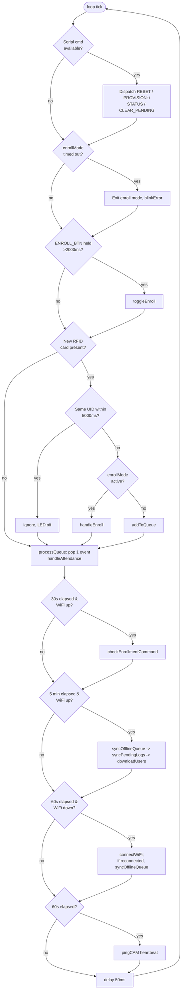
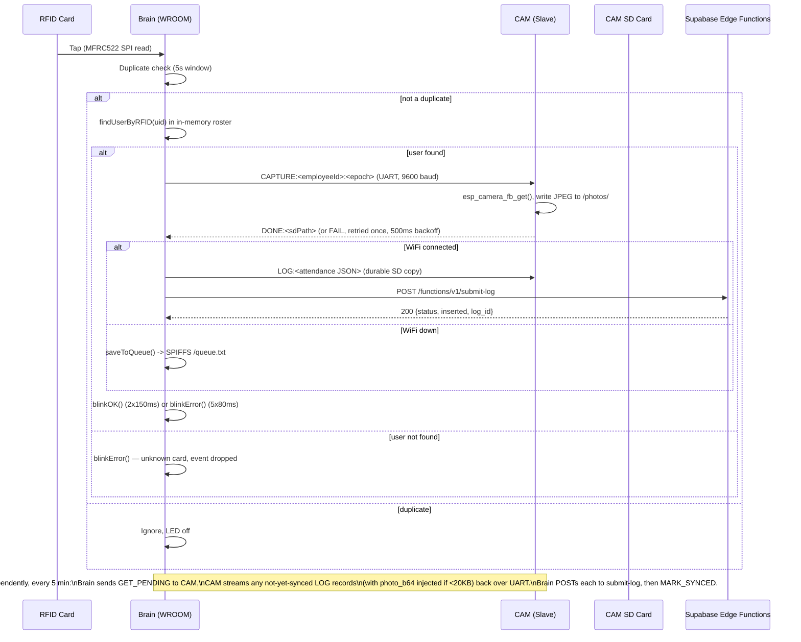

# Firmware Architecture

This document describes the current, as-shipped behavior of the two ESP32 firmware images in this repository:

- `firmware/wroom_brain/wroom_brain.ino` (1191 lines) + `firmware/wroom_brain/provision_portal.h` (468 lines) — the **Brain** board
- `firmware/esp32cam_slave/esp32cam_slave.ino` (668 lines) — the **CAM (Slave)** board

Every claim below is traceable to a specific line in those files. Where behavior could not be confirmed from source, it is marked `TODO: Needs verification`.

The two root-level files `ESP32-WROOM BRAIN FIRMWARE.md` and `ESP32-CAM SLAVE FIRMWARE.md` describe an earlier, pre-Supabase generation of this firmware and are **stale** — they are superseded by this document and by `docs/PROJECT_STRUCTURE.md` (Phase 3 cleanup will formally deprecate them).

## 1. Two-board split

One physical installation ("site") consists of two independently-flashed ESP32 boards connected by a 4-wire UART link (2 signal + power/GND):

| Board | Chip | Owns | Does NOT own |
|---|---|---|---|
| **Brain** | ESP32-WROOM-32 | WiFi, MFRC522 RFID reader, enroll button, status LED, all HTTPS calls to Supabase, NVS credential storage, offline queue (SPIFFS) | Camera, SD card, no persistent photo storage |
| **CAM (Slave)** | ESP32-CAM (OV2640) | OV2640 camera, SD card (`SD_MMC`), durable JSONL attendance log storage, photo storage/retention | WiFi (no network stack at all), no HTTPS, no knowledge of Supabase |

The split exists because the ESP32-CAM's GPIOs are largely consumed by the camera parallel bus and SD_MMC lines, leaving too few free pins to also drive the MFRC522 over SPI reliably, and because keeping camera work (which blocks for tens to hundreds of ms) off the board that also has to service WiFi/HTTP reduces the chance of a stalled RFID read. The two boards only exchange plain-text line commands over UART — the CAM has no network stack and cannot reach Supabase directly (`firmware/esp32cam_slave/esp32cam_slave.ino:22-28` — only `esp_camera.h`, `SD_MMC.h`, `FS.h`, no `WiFi.h`).

**There is no relay, solenoid, lock, or door-strike control anywhere in either firmware file.** A repo-wide search for `relay|solenoid|door|lock|strike` in `firmware/` returns no hardware-control matches. Despite the product being framed as "access control," the current firmware only **logs** `check_in`/`check_out` attendance events — it does not actuate any physical access mechanism.

## 2. Brain: pin map

Confirmed at `firmware/wroom_brain/wroom_brain.ino:63-70`:

| Signal | GPIO | Notes |
|---|---|---|
| `RFID_SS` | 5 | MFRC522 SPI chip-select |
| `RFID_SCK` | 18 | MFRC522 SPI clock |
| `RFID_MOSI` | 23 | MFRC522 SPI MOSI |
| `RFID_MISO` | 19 | MFRC522 SPI MISO |
| RFID RST | tied to 3.3V | No GPIO reset pin used — `MFRC522 rfid(RFID_SS, -1)` at line 96 passes `-1` for reset pin |
| `CAM_RX` | 16 | Brain's UART2 RX — receives from CAM's TX |
| `CAM_TX` | 17 | Brain's UART2 TX — sends to CAM's RX |
| `ENROLL_BTN` | 4 | `INPUT_PULLUP`, active-low, hold 2s to toggle manual enroll mode |
| `STATUS_LED` | 2 | Onboard/status LED, active-high |

UART2 (`HardwareSerial camSerial(2)`) is opened at 9600 baud, 8N1: `camSerial.begin(9600, SERIAL_8N1, CAM_RX, CAM_TX)` (`wroom_brain.ino:308`).

See `docs/HARDWARE.md` for the full physical wiring reference including the CAM-side pin numbers and cross-wiring table.

## 3. Brain: boot sequence

`setup()` (`wroom_brain.ino:244-357`) runs, in order:

1. `Serial.begin(115200)`, print build timestamp, restore cached time from NVS (`loadCachedTime()`).
2. Print reset reason (`esp_reset_reason()`).
3. Hardware watchdog init is present in source but **entirely commented out** — see §9, Known Limitations.
4. 3 quick LED flashes (200ms on/off) as a "device alive" signal.
5. Mount SPIFFS (`SPIFFS.begin(true)`) — used for the offline attendance queue file `/queue.txt`. If mount fails, offline queueing is disabled but boot continues.
6. Bring up WiFi in `WIFI_STA` mode just far enough to read the MAC address into `DEVICE_UID`.
7. Open UART2 to the CAM (9600 baud) and `pingCAM()` to verify it's alive (non-fatal warning if not).
8. Initialize MFRC522 over SPI, read `VersionReg`, warn if not `0x91`/`0x92`.
9. **Provisioning check**: `isProvisioned()` reads NVS namespace `ecotron` for a non-empty `device_secret`. If unprovisioned, calls `enterProvisioningMode()` and `setup()` never returns — the device either provisions and reboots, or sits in the captive portal loop indefinitely (see §4).
10. If provisioned: `connectWiFi()`, `loadCredentials()` from NVS, then if WiFi connected: `syncNTPTime()`, `downloadUsers()`, `syncPendingLogs()`. If WiFi is down at boot, falls back to `loadUsersFromCache()` (pulls the roster the CAM cached on SD from the last successful sync).
11. Print free heap, `blinkOK()` (2 slow blinks), enter `loop()`.

## 4. Provisioning flow (current, live)

Implemented in `firmware/wroom_brain/provision_portal.h`. This is the **only** provisioning UX currently wired into `wroom_brain.ino`; three other designs (MAC-based pairing codes, auto-discovery AP-claim) exist as root-level markdown docs and were reverted in git history — they are not implemented in current firmware and are out of scope for this document. Full provisioning design/rationale is covered in `docs/PROVISIONING.md`; this section only describes what the firmware code does.

1. Unprovisioned boot brings up an **open** (no password) WiFi Access Point named `GATEMAN-SETUP-<last4hexofMAC>` (`provision_portal.h:426-435`, `WiFi.softAP(apSSID.c_str())` with no password argument).
2. A `DNSServer` on port 53 answers all names with the AP's own IP (captive-portal style, `dnsServer.start(53, "*", IP)`), and a `WebServer` on port 80 serves an embedded HTML page (`PROVISION_HTML`) at `/`. Any unknown path 302-redirects to `/` (`handleNotFound`).
3. The page embeds a QR scanner using `jsQR` loaded from a CDN (`https://cdn.jsdelivr.net/npm/jsqr@1.4.0/dist/jsQR.min.js`, `provision_portal.h:207`) to scan an admin-generated provisioning token, or the token can be pasted manually. This requires the connecting phone to have **internet access** to fetch the CDN script while the phone itself is joined to the device's offline AP — a real ordering dependency worth calling out for field techs.
4. On submit, the page `POST`s `{token, ssid, password}` to `/save-wifi` (`handleSaveWiFi`, `provision_portal.h:345-416`).
5. The handler saves WiFi credentials to NVS namespace `gateman` (`wifi_ssid`, `wifi_pass`), stops the AP/DNS/web server, switches to `WIFI_STA`, and attempts to connect (20 retries × 500ms).
6. On successful WiFi connect, calls `provisionDevice(token)` (defined in the main `.ino`, forward-declared at `wroom_brain.ino:30`), which `POST`s `{device_uid, provisioning_token}` to `<SUPABASE_URL>/functions/v1/device-provision`.
7. On HTTP 200, the response `{device_secret, device_id, supabase_url}` is persisted to NVS namespace `ecotron` via `saveCredentials()` and the device calls `ESP.restart()`. On failure, the AP loop is not resumed automatically — the board falls through to `ESP.restart()` after a WiFi-connect failure, or simply logs the failure and stops (see `provisionDevice`, `wroom_brain.ino:211-215`, which does not reboot on failure — it just returns from `setup()`'s call chain).

The AP's `startProvisioningPortal()` runs an internal blocking `while(true)` loop (`provision_portal.h:456-465`) handling DNS/HTTP requests and slow-blinking the status LED (500ms on/off) — it never returns to `setup()`/`loop()` until the device reboots.

## 5. Brain main loop

`loop()` (`wroom_brain.ino:485-611`) runs, every iteration, in this order:

1. Drain and dispatch a pending Serial debug command, if any (see §8).
2. Auto-timeout enrollment mode if `enrollMode` has been active longer than `ENROLL_TIMEOUT_MS` (60s).
3. Poll the enroll button (`GPIO4`); if held low continuously for >2000ms, `toggleEnroll()` and 500ms debounce delay.
4. Poll the MFRC522 for a new card. On read: immediate LED-on flash, duplicate-tap check against `lastUID`/`lastTapMs` within `DUPLICATE_WINDOW` (5000ms) — duplicates are dropped silently (LED off, log line only). Non-duplicate taps either go to `handleEnroll(uid)` (if `enrollMode`) or `addToQueue(uid, getEpochTime())`.
5. `processQueue()` — pops one queued tap (if any) and calls `handleAttendance()` synchronously.
6. Every `ENROLL_POLL_MS` (30s), if not already in enroll mode and WiFi is connected: `checkEnrollmentCommand()` polls the backend for an admin-initiated enrollment request.
7. Every 300000ms (5 min), if WiFi connected: `syncOfflineQueue()` (SPIFFS queue), then `syncPendingLogs()` (CAM-held queue), then `downloadUsers()`.
8. Every 60000ms, if WiFi is down: attempt `connectWiFi()`; if it just reconnected and there are queued offline logs, immediately `syncOfflineQueue()`.
9. Every `HEARTBEAT_MS` (60000ms): `pingCAM()`.
10. `delay(50)`.

Everything here runs on a single core/thread with blocking calls (SPI reads, UART round-trips, `HTTPClient` requests) — see §9.

## 6. Attendance-tap sequence (RFID → CAM → queue → sync)

Notes on the diagram, cross-checked against source:

- `sendCaptureCommand()` (`wroom_brain.ino:791-809`) makes **2 attempts**, each with an 8000ms (`CAM_TIMEOUT_MS`) wait window, and a 500ms delay between attempts. If both fail, attendance is still logged with an empty `photo` string — a genuine no-photo fallback, not an error state.
- `logAttendance()` (`wroom_brain.ino:814-832`): if WiFi is down, the event goes to the **SPIFFS** offline queue (`/queue.txt`) via `saveToQueue()`, bypassing the CAM's `LOG:` command entirely. If WiFi is up, it's sent to the CAM via `LOG:<json>` for durable SD-side storage, and `handleAttendance()` (`wroom_brain.ino:780`) then immediately calls `syncPendingLogs()` rather than waiting for the 5-minute cycle.
- `unknown card` (RFID UID not present in the locally cached roster) results in `blinkError()` and the event is **dropped** — never queued, never sent to CAM, never logged (`wroom_brain.ino:769`).

## 7. Brain↔CAM UART protocol

Plain-text, newline-delimited (`readStringUntil('\n')`), no framing byte, no checksum, no protocol version field. Either side can desync if a line is dropped or corrupted — there is no resend/ack layer beyond the application-level retries described below.

| Command (Brain→CAM) | Format | CAM response | Notes |
|---|---|---|---|
| `PING` | `PING` | `PONG` | Heartbeat, sent every `HEARTBEAT_MS` (60s); also used at Brain boot to verify CAM link |
| `CAPTURE:<employeeId>:<epoch>` | e.g. `CAPTURE:E1042:1767225600` | `DONE:<sdPath>` or `FAIL` | 2-attempt retry with 500ms backoff on Brain side; CAM saves JPEG to `/photos/<employeeId>_<YYYYMMDD_HHMMSS>.jpg` |
| `LOG:<json>` | `LOG:{"user_id":...,"action":"check_in",...}` | *(no ack)* | CAM appends the raw line, unvalidated, to `/pending/<YYYY-MM-DD>.jsonl` |
| `GET_PENDING` | `GET_PENDING` | `BEGIN_LOGS` ... lines ... `END_LOGS` | CAM streams every `.jsonl` line under `/pending/`; injects `photo_b64` if `image_path` resolves to a file <20000 bytes on SD |
| `MARK_SYNCED` | `MARK_SYNCED` | *(no ack)* | CAM renames every `/pending/*.jsonl` to `/synced/*.jsonl`; Brain also triggers `cleanOldPhotos()` + `checkStorage()` locally after sending this |
| `CLEAR_ALL` | `CLEAR_ALL` | `CLEARED` | Deletes every file under `/pending/`; used by Brain's Serial `CLEAR_PENDING`/`CLEAR_CAM` command and automatically after >10 sync failures in one cycle |
| `SAVE_USERS:<json>` | `SAVE_USERS:{"users":[...]}` | `USERS_SAVED` or `USERS_FAIL` | Roster cache write to `/users.json` on SD |
| `GET_USERS` | `GET_USERS` | `USERS:<json>` (or `USERS:{}`) | Roster cache read, used when Brain boots offline |
| `SAVE_ENROLL:<uid>:<photoPath>` | `SAVE_ENROLL:04A1B2C3:/photos/ENROLL_...jpg` | `ENROLL_SAVED` or `ENROLL_FAIL` | Only used when `handleEnroll()` runs while WiFi is down (`wroom_brain.ino:697`); appended to `/enrollments.jsonl` |
| `DELETE_USER:<userId>` | — | `USER_DELETED` or `DELETE_FAIL` | Handled by CAM (`handleDeleteUser`) but **not called from `wroom_brain.ino`** in this codebase — dead code path from the Brain side as of this version |
| `UPDATE_USER:<userId>:<json>` | — | `USER_UPDATED` or `UPDATE_FAIL` | Handled by CAM (`handleUpdateUser`) but likewise **not called from `wroom_brain.ino`** |
| `GET_HEALTH` | — | `HEALTH:{"heap":...,"uptime":...,"sd_used_pct":...}` | Handled by CAM (`handleGetHealth`) but **not called from `wroom_brain.ino`** |

`DELETE_USER`, `UPDATE_USER`, and `GET_HEALTH` are fully implemented in `esp32cam_slave.ino` (`esp32cam_slave.ino:499-630`) but no code path in `wroom_brain.ino` currently issues them — confirmed by grepping `wroom_brain.ino` for those literal strings (no matches). They appear to be planned/legacy hooks, not live functionality.

## 8. Backend API calls (Brain → Supabase)

All calls are HTTPS `POST` to `<SUPABASE_URL>/functions/v1/<function>`, with headers `Content-Type: application/json`, `apikey: <SUPABASE_ANON_KEY>`, `Authorization: Bearer <SUPABASE_ANON_KEY>`. The `Authorization`/`apikey` headers only satisfy the Supabase gateway's JWT check on the anon key — the actual per-device identity/authorization is `device_uid` + `device_secret` carried inside the JSON body and checked by `authenticateDevice()` in `supabase/functions/_shared/auth.ts:25-62` (plaintext comparison against the `devices.device_secret` column, no hashing). See `docs/SECURITY.md` for the security analysis of this scheme.

| Function | Called from | Trigger | Body fields sent by firmware | Verified response handling |
|---|---|---|---|---|
| `device-provision` | `provisionDevice()`, `wroom_brain.ino:175-216` | First boot, unprovisioned | `device_uid`, `provisioning_token` | 200 → parses `device_secret`, `device_id`, `supabase_url`, persists to NVS `ecotron`, `ESP.restart()` |
| `submit-log` | `syncPendingLogs()` (`:837-930`), `syncOfflineQueue()` (`:402-480`) | Per attendance event once CAM confirms `LOG` write; also periodic replay of CAM/SPIFFS queues | `device_uid`, `device_secret`, `device_event_id`, `credential_value` (RFID UID), `event_time` (ISO8601), `action`, optional `photo_base64` + `photo_mime` | 200 → response body checked for the literal substring `"true"` to distinguish new insert vs. duplicate (`resp.indexOf("true") > -1`) — a fragile string-match against the Edge Function's `{status,inserted,log_id}` JSON, not a proper field parse |
| `get-users` | `downloadUsers()`, `:935-978` | Boot (if WiFi up) and every periodic sync cycle | `device_uid`, `device_secret` | 200 → parses `{users:[{user_id,name,employee_id,department,rfid_uid}]}`, rebuilds in-memory `users[]`, forwards the raw payload to CAM via `SAVE_USERS:` for offline cache |
| `check-enrollment` | `checkEnrollmentCommand()`, `:710-744` | Every `ENROLL_POLL_MS` (30s), only when not already in enroll mode | `device_uid`, `device_secret` | 200 → if `enroll:true`, sets `activeEnrollmentId`, enters `enrollMode`, resets `enrollTimeout`, rapid-blinks LED |
| `device-enroll` | `handleEnroll()`, `:661-704` | A tap while `enrollMode` is active, for a UID not already known | `device_uid`, `device_secret`, `credential_value`, optional `enrollment_id`, `photo_path`, `timestamp` | 200/201 → `downloadUsers()` + `blinkOK()`; else `blinkError()` |

All five endpoint names, HTTP methods, and header sets above were cross-checked directly against `wroom_brain.ino` call sites and against the corresponding handlers in `supabase/functions/*/index.ts`.

### Confirmed bug: enrollment photos never reach the backend

`handleEnroll()` sends the field `photo_path` (a CAM-local SD path string, e.g. `/photos/ENROLL_20260301_120000.jpg`) to `device-enroll` (`wroom_brain.ino:675`). The `device-enroll` Edge Function (`supabase/functions/device-enroll/index.ts:11`) destructures `photo_base64` from the request body — it never reads `photo_path` — and only uploads a photo when `photo_base64` is present (`index.ts:141`). Since the firmware never sends `photo_base64` for enrollment (only the SD path string), **enrollment photos are captured on the CAM board but never uploaded to Supabase Storage**, regardless of whether the enrollment is admin-initiated or legacy device-initiated. This is distinct from attendance photos, which do work: `syncPendingLogs()`/`syncOfflineQueue()` correctly populate `photo_base64` for `submit-log` (`wroom_brain.ino:882-884`, `:433-435`), and `submit-log/index.ts:152-179` reads that field correctly.

## 9. CAM firmware responsibilities

`firmware/esp32cam_slave/esp32cam_slave.ino` has no WiFi stack and only reacts to UART commands from the Brain (dispatch table at `esp32cam_slave.ino:136-147`). Its own responsibilities:

- **Camera capture** (`handleCapture`, `:168-187`) — grabs one frame buffer and writes it as JPEG to `/photos/`.
- **Durable log storage** (`handleLog`, `:192-197`) — appends whatever JSON string the Brain sends to `/pending/<date>.jsonl`, **with zero validation or parsing** of the JSON structure.
- **Pending log replay** (`handleGetPending`, `:202-256`) — streams stored records back to the Brain, doing manual substring search (`indexOf("\"image_path\":\"")`) to locate and inject base64 photo data rather than JSON-parsing the line.
- **Sync bookkeeping** (`handleMarkSynced`, `:281-296`) — renames files from `/pending/` to `/synced/` (no delete; retained until storage cleanup or explicit `CLEAR_ALL`).
- **Storage health** (`checkStorage`/`deleteOldSynced`, `:301-364`) — if SD usage exceeds `STORAGE_MAX_PCT` (90%), deletes oldest `/synced/*.jsonl` files (sorted by `entry.getLastWrite()`) until usage drops to `TARGET_PCT` (85%), scanning at most 100 files per pass (fixed-size `String files[100]` / `time_t fileTimes[100]` arrays). Note: the `KEEP_SYNCED_DAYS` constant (`:52`) is defined but **never referenced anywhere else in the file** — synced-log cleanup is purely usage-threshold-driven, not age-driven.
- **Photo retention** (`cleanOldPhotos`, `:369-410`) — parses the embedded timestamp out of each `/photos/*.jpg` filename and deletes files older than `PHOTO_KEEP_DAYS` (30 days); skipped entirely if the CAM's own clock (`time()`) reads before `1700000000` (i.e., time was never set — CAM has no NTP/RTC of its own, so this guard matters whenever the board hasn't received a valid time some other way).
- **Roster cache** (`handleSaveUsers`/`handleGetUsers`, `:415-466`) — raw JSON blob read/write to `/users.json`.
- **Enrollment cache** (`handleSaveEnroll`, `:471-497`) — appends to `/enrollments.jsonl`; only reached via the Brain's offline fallback path.
- **User CRUD via string splicing** (`handleDeleteUser`/`handleUpdateUser`, `:499-614`) — locates a user record inside `/users.json` using `indexOf`/`lastIndexOf` on raw text and mutates the string in place, rather than parsing to a JSON document and re-serializing. As noted in §7, neither is currently invoked by the Brain.
- **Health snapshot** (`handleGetHealth`, `:616-630`) — returns free heap, uptime, and SD usage percentage as JSON. Not currently invoked by the Brain.

### Camera configuration

Confirmed at `esp32cam_slave.ino:100-118`:

| Setting | Value |
|---|---|
| Frame size | `FRAMESIZE_QQVGA` (160×120) |
| Pixel format | `PIXFORMAT_JPEG` |
| JPEG quality | `20` (set twice: in `cfg.jpeg_quality` and again via `s->set_quality(s,20)`) |
| Color mode | Grayscale — `s->set_special_effect(s,2)` |
| Frame buffer count | `1` (`fb_count=1`, no double buffering) |
| XCLK frequency | `20000000` Hz |

This is a deliberately minimal profile — small JPEGs keep both the `GET_PENDING` UART transfer (`photo_b64` injected only if the source file is <20000 bytes, `esp32cam_slave.ino:225`) and SD usage manageable. Larger captured photos are silently excluded from the synced payload (the JSONL record and `image_path` remain intact on SD; only the `photo_b64` field is omitted for that record).

### CAM pin map (OV2640 + SD_MMC + UART)

Confirmed at `esp32cam_slave.ino:30-49`. See `docs/HARDWARE.md` for the full pinout table and wiring diagram.

## 10. NVS namespace layout

Two `Preferences` namespaces on the Brain board (`Preferences` is backed by unencrypted ESP32 NVS flash — no flash encryption is configured; see `docs/SECURITY.md`):

| Namespace | Keys | Written by | Purpose |
|---|---|---|---|
| `ecotron` | `device_uid`, `device_secret`, `device_id`, `supabase_url`, `event_ctr` (`unsigned long`), `last_epoch` (`uint64_t`) | `saveCredentials()`, `saveEventCounter()`, `saveCurrentTimeSnapshot()`, Serial `PROVISION:<secret>` | Device identity, backend credential, monotonic event counter (for idempotent `device_event_id` generation), last-known-good UTC epoch (survives reboot without NTP) |
| `gateman` | `wifi_ssid`, `wifi_pass`, `needs_prov` (`bool`), `prov_token` | `handleSaveWiFi()` (`provision_portal.h`), `enterProvisioningMode()` | WiFi credentials and pending-provisioning-token handoff between the captive portal and the main provisioning call |

`isProvisioned()` (`wroom_brain.ino:129-134`) is the sole gate for entering provisioning mode vs. normal operation — it checks only whether `ecotron/device_secret` is non-empty.

## 11. LED feedback protocol

`STATUS_LED = GPIO2` (Brain board). All patterns confirmed in source:

| Pattern | Function / call site | Meaning |
|---|---|---|
| 3× 200ms on/off | `setup()`, `wroom_brain.ino:285-288` | Boot — device alive |
| 2× 150ms on/off | `blinkOK()`, `:1178` | Success (attendance logged, enroll succeeded, provisioning boot readiness) |
| 5× 80ms on/off | `blinkError()`, `:1179` | Failure (unknown card, enroll timeout, enroll error) |
| 6× 80ms on/off | `toggleEnroll()` (`:653`) and `checkEnrollmentCommand()` (`:739`) | Enroll mode becoming active (manual button or server-initiated) |
| 500ms on / 500ms off, continuous | `startProvisioningPortal()`, `provision_portal.h:460-464` | Provisioning AP is up, waiting for setup submission |
| Momentary on during read | RFID tap handling, `:558-567` | Card detected (LED held high until duplicate-check resolves) |

The CAM board has its own `LED_PIN = GPIO33`, flashed 3× 200ms at boot and momentarily during `handleCapture()` (`esp32cam_slave.ino:175-186`) — otherwise it carries no status semantics.

## 12. Serial debug console (Brain, 115200 baud)

Dispatched in `loop()`, `wroom_brain.ino:489-530`:

| Command | Effect |
|---|---|
| `RESET` / `FACTORY_RESET` | Clears **both** NVS namespaces (`ecotron`, `gateman`) and `ESP.restart()`s into provisioning mode |
| `PROVISION:<secret>` | Writes `<secret>` directly into NVS `ecotron/device_secret` and reboots — **bypasses the backend `device-provision` call entirely**. This is a maintenance/debug affordance; see `docs/SECURITY.md` for the implications of a serial-accessible credential bypass |
| `CLEAR_PENDING` / `CLEAR_CAM` | Sends `CLEAR_ALL` to the CAM over UART, deleting all pending (unsynced) attendance JSONL files on SD |
| `STATUS` | Dumps `DEVICE_ID`, `SUPABASE_URL`, `DEVICE_SECRET` (first 8 chars + total length only — not printed in full), WiFi connection state + IP, free heap, and in-memory user count (`wroom_brain.ino:517-529`) |

## 13. Magic-number reference table

| Constant | Value | Defined at | Meaning |
|---|---|---|---|
| `QUEUE_SIZE` | 50 | `wroom_brain.ino:75` | Ring-buffer size for in-flight RFID taps awaiting `processQueue()` |
| `MAX_USERS` | 100 | `:76` | Fixed-size in-memory roster cap on the Brain |
| `CAM_TIMEOUT_MS` | 8000 | `:77` | Per-attempt wait for a CAM `DONE:`/`FAIL` response to `CAPTURE:` |
| `DUPLICATE_WINDOW` | 5000 ms | `:78` | Re-tap suppression window for the same UID |
| `WDT_TIMEOUT_S` | 60 | `:79` | Intended hardware watchdog timeout — **unused**, watchdog is disabled |
| `HEARTBEAT_MS` | 60000 | `:80` | Brain→CAM `PING` interval |
| `SYNC_MAX_PER_CYCLE` | 20 | `:81` | Max records processed per `syncPendingLogs()`/`syncOfflineQueue()` call |
| `HTTP_TIMEOUT_MS` | 8000 | `:82` | Per-request `HTTPClient` timeout for `submit-log` and related calls |
| `ENROLL_POLL_MS` | 30000 | `:119` | `check-enrollment` polling interval |
| `ENROLL_TIMEOUT_MS` | 60000 | `:120` | Auto-exit enroll mode if no successful enrollment occurs |
| `STORAGE_MAX_PCT` | 90.0% | `esp32cam_slave.ino:51` | SD usage threshold that triggers `deleteOldSynced()` |
| `TARGET_PCT` | 85.0% | `esp32cam_slave.ino:310` (local const inside `deleteOldSynced`) | Cleanup stops once usage drops to this level |
| `PHOTO_KEEP_DAYS` | 30 | `esp32cam_slave.ino:53` | Age threshold for deleting `/photos/*.jpg` |
| `KEEP_SYNCED_DAYS` | 30 | `esp32cam_slave.ino:52` | Defined but **unused** — dead constant, see §9 |
| Photo injection size cap | 20000 bytes | `esp32cam_slave.ino:225` | `photo_b64` is only injected into `GET_PENDING` output if the source JPEG is smaller than this |
| Cleanup file scan cap | 100 files/pass | `esp32cam_slave.ino:315-316` | Fixed-size arrays in `deleteOldSynced()` |

## 14. Known limitations

Documented factually; these are the gaps a maintainer or auditor should know about before relying on this system.

- **Hardware watchdog is fully disabled on both boards.** Every `esp_task_wdt_*` call is commented out in both `.ino` files, with the same comment on each board: "was causing constant resets" / "was causing constant reboots" (`wroom_brain.ino:268-275`, `esp32cam_slave.ino:70-77`). A genuine hang on either board (e.g. a stuck HTTP call, a wedged I2C/SPI transaction) will not self-recover; the device requires a manual power cycle.
- **Everything is single-threaded and blocking.** RFID scanning, camera round-trips over UART, and all Supabase HTTP calls share one `loop()` iteration with multi-second timeouts (`CAM_TIMEOUT_MS`, `HTTP_TIMEOUT_MS` both 8000ms). A slow or unresponsive backend call can stall RFID scanning and CAM heartbeats for the duration of the timeout.
- **No OTA update mechanism exists in either firmware image.** There is no `ArduinoOTA`, no `Update.h` usage, no HTTP firmware-pull logic in either `.ino`. Firmware updates require physical USB access to each device.
- **The offline queue has no max-age check, but the server enforces a 7-day acceptance window.** Both the SPIFFS queue (`saveToQueue`/`syncOfflineQueue`, Brain) and the CAM's `/pending/*.jsonl` queue accumulate indefinitely with no expiry logic on the device side. `submit-log/index.ts:71-73` rejects any `event_time` more than 7 days old (HTTP 422). On a long outage (>7 days), previously-queued events will be silently rejected by the server when connectivity resumes and the firmware does not distinguish this rejection from a transient failure — it is simply counted as `failed` and, if failures exceed 10 in a sync cycle, the entire CAM-side pending queue is wiped via `CLEAR_ALL` (`wroom_brain.ino:925-929`). This is a real data-loss risk for sites with outages longer than a week.
- **CAM-side user CRUD does manual string splicing instead of JSON parsing.** `handleDeleteUser`/`handleUpdateUser` (`esp32cam_slave.ino:499-614`) locate and mutate records in `/users.json` using `indexOf`/`lastIndexOf` on the raw string rather than deserializing to a JSON document. This is corruption-prone on malformed or unexpected input shapes. Note also that neither command is currently invoked from the Brain firmware (§7), so this code path is presently dormant.
- **Enrollment photos never reach the backend** — a confirmed bug, detailed in §8. The photo is captured and saved locally on the CAM's SD card but the field name mismatch between firmware (`photo_path`) and the `device-enroll` Edge Function (`photo_base64`) means it is never uploaded. Attendance photos are unaffected — they use a different, correctly-matched field name.
- **No encryption at rest for device credentials.** NVS is unencrypted flash (no ESP32 flash-encryption fuses configured, based on the absence of any `esp_flash_encryption_*`/`NVS_ENCR*` calls in source); see `docs/SECURITY.md`.
- **`submit-log` duplicate detection on the firmware side relies on a substring match**, not structured JSON parsing (§8) — brittle if the response body shape ever changes.
