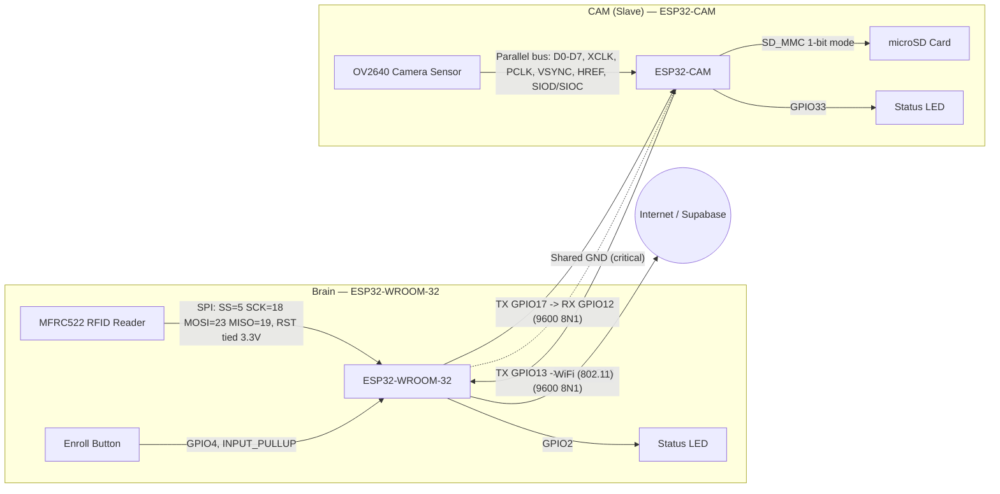

# Hardware Reference

This document covers the physical hardware referenced by the firmware in `firmware/wroom_brain/` and `firmware/esp32cam_slave/`. All pin numbers are taken directly from the `#define` blocks and wiring comments in the source; anything not derivable from the repository is marked `TODO: Needs verification` rather than assumed. No product photos exist yet, so this document is text/diagram-only.

## 1. Board roles

| Board | MCU | Confirmed peripherals | Source |
|---|---|---|---|
| **Brain** | ESP32-WROOM-32 (per header comment `EcoTronic — ESP32-WROOM (Brain)`) | MFRC522 RFID reader (SPI), enroll pushbutton, status LED, UART link to CAM | `firmware/wroom_brain/wroom_brain.ino:1-17` |
| **CAM (Slave)** | ESP32-CAM module with OV2640 camera sensor | OV2640 camera (parallel bus), microSD card via `SD_MMC` (1-bit/4-bit SDIO), status LED, UART link to Brain | `firmware/esp32cam_slave/esp32cam_slave.ino:1-49` |

Exact board/module part numbers (e.g. specific ESP32-WROOM-32 dev-board vendor, specific ESP32-CAM PCB revision) are not present anywhere in the repository — `TODO: Needs verification`.

## 2. Brain board — GPIO pinout

Confirmed at `firmware/wroom_brain/wroom_brain.ino:63-70` (`#define` block) and the header wiring comment at lines 12-16:

| Function | GPIO | Direction | Notes |
|---|---|---|---|
| RFID SS (SDA/CS) | GPIO5 | Brain → RC522 | `RFID_SS` |
| RFID SCK | GPIO18 | Brain → RC522 | `RFID_SCK`, shared hardware SPI bus |
| RFID MOSI | GPIO23 | Brain → RC522 | `RFID_MOSI` |
| RFID MISO | GPIO19 | RC522 → Brain | `RFID_MISO` |
| RFID RST | tied to 3.3V | — | No GPIO reset control — `MFRC522 rfid(RFID_SS, -1)` passes `-1` for the reset pin argument (`wroom_brain.ino:96`); the header comment confirms `RST → 3.3V` (hardware reset pin is hard-tied high, not software-controlled) |
| UART to CAM (RX) | GPIO16 | CAM TX → Brain RX | `CAM_RX`, `HardwareSerial camSerial(2)`, 9600 baud 8N1 |
| UART to CAM (TX) | GPIO17 | Brain TX → CAM RX | `CAM_TX` |
| Enroll button | GPIO4 | Button → Brain | `ENROLL_BTN`, `INPUT_PULLUP`, active-low, hold 2s to toggle |
| Status LED | GPIO2 | Brain → LED | `STATUS_LED`, active-high |
| Boot-mode pulldown helper | GPIO0 | — | Explicitly set `INPUT_PULLUP` in `setup()` "to help with boot mode" (`wroom_brain.ino:251`) — standard ESP32 strapping pin, not a peripheral connection |

## 3. CAM board — GPIO pinout

Confirmed at `firmware/esp32cam_slave/esp32cam_slave.ino:30-49`. This is the standard AI-Thinker ESP32-CAM camera pin assignment (OV2640 parallel interface + SCCB), plus the two UART lines used for the Brain link:

| Function | GPIO | Notes |
|---|---|---|
| `PWDN` | GPIO32 | Camera power-down control |
| `RESET` | not used (-1) | `RESET_GPIO_NUM = -1` |
| `XCLK` | GPIO0 | Camera external clock, 20 MHz (`xclk_freq_hz=20000000`) |
| `SIOD` (SCCB/I2C data) | GPIO26 | Camera control bus |
| `SIOC` (SCCB/I2C clock) | GPIO27 | Camera control bus |
| `Y9`–`Y2` (8-bit data bus) | GPIO35, 34, 39, 36, 21, 19, 18, 5 | `Y9..Y2` map to `pin_d7..pin_d0` respectively |
| `VSYNC` | GPIO25 | Camera frame sync |
| `HREF` | GPIO23 | Camera line sync |
| `PCLK` | GPIO22 | Camera pixel clock |
| UART to Brain (RX) | GPIO12 | `WROOM_RX` — receives commands from Brain's `CAM_TX` (GPIO17) |
| UART to Brain (TX) | GPIO13 | `WROOM_TX` — sends responses to Brain's `CAM_RX` (GPIO16) |
| Status LED | GPIO33 | `LED_PIN`, active-high, flashed at boot and during capture |
| SD card | via `SD_MMC.begin("/sdcard", true)` | `esp32cam_slave.ino:93` — the boolean `true` argument requests 1-bit SDIO mode (standard for AI-Thinker boards where 4-bit mode conflicts with camera pins). Exact SD/TF slot electrical pins are internal to the `SD_MMC` peripheral driver on ESP32-CAM and not separately defined in this firmware |

Note that GPIO5, 18, 19, 23 are reused for **both** the CAM's parallel camera bus (`Y2`, `Y3`, `Y4`, `HREF`) **and** the Brain's RFID SPI bus (`RFID_SS`, `RFID_SCK`, `RFID_MISO`, `RFID_MOSI` respectively) — this is not a conflict since they are two physically separate ESP32 chips, but it explains why the two boards cannot be collapsed onto a single MCU without a full pin remap.

## 4. Cross-board UART wiring

The Brain and CAM communicate over a single asynchronous UART link, plain-text newline-delimited (see `docs/FIRMWARE.md` §7 for the protocol). Confirmed cross-wiring from both firmware files' pin definitions and header comments:

| Signal | Brain pin | CAM pin | Direction |
|---|---|---|---|
| Data | Brain `CAM_TX` = GPIO17 | CAM `WROOM_RX` = GPIO12 | Brain → CAM |
| Data | Brain `CAM_RX` = GPIO16 | CAM `WROOM_TX` = GPIO13 | CAM → Brain |
| Ground | — | — | Shared GND required — both firmware headers flag this explicitly as critical (`wroom_brain.ino:14`, `esp32cam_slave.ino:18`: "Shared GND — CRITICAL") |

Baud rate: 9600, 8 data bits, no parity, 1 stop bit (`SERIAL_8N1`) on both ends — confirmed at `wroom_brain.ino:308` and `esp32cam_slave.ino:91`.

## 5. Power

Both `.ino` header comments state supply expectations but the repository contains no schematic, power-budget calculation, or regulator part selection:

- CAM board header comment: `5V from dedicated 2A supply` (`esp32cam_slave.ino:19`) — this is the only power figure present anywhere in the codebase, and it is a comment, not something enforced or measured by firmware.
- Brain board: no supply voltage/current figure is stated anywhere in `wroom_brain.ino`.
- Whether both boards share a single supply rail, use separate regulators, or what the RFID reader's (RC522, typically 3.3V-only) supply/level-shifting arrangement is: `TODO: Needs verification`.
- Battery/backup power, brownout behavior beyond the firmware's `ESP_RST_BROWNOUT` boot-reason logging (`wroom_brain.ino:264`), and enclosure power entry: `TODO: Needs verification`.

## 6. Partial Bill of Materials

This is a best-effort reconstruction from components the firmware clearly drives. It is **not** a purchasing BOM — no supplier, part number, or price is fabricated. Every unresolved line is marked `TODO: Needs verification`.

| Item | Qty per site | Source of confirmation | Notes |
|---|---|---|---|
| ESP32-WROOM-32 based dev board (Brain) | 1 | `wroom_brain.ino` header, GPIO map | Specific board vendor/model: `TODO: Needs verification` |
| ESP32-CAM module (AI-Thinker-pinout compatible, OV2640) | 1 | `esp32cam_slave.ino` camera pin map matches the standard AI-Thinker ESP32-CAM assignment | Specific vendor/revision: `TODO: Needs verification` |
| MFRC522 RC522 RFID reader module (13.56 MHz) | 1 | `#include <MFRC522.h>`, SPI pin map | Confirmed by library include and pin wiring, not by a part-number string anywhere in source |
| microSD / TF card | 1 (on CAM board) | `SD_MMC.begin("/sdcard", true)` | Capacity/class requirement: `TODO: Needs verification` |
| Momentary pushbutton (enroll) | 1 | `ENROLL_BTN`, `INPUT_PULLUP` wiring | Wired to GND per pullup convention |
| Status LED ×2 (one per board) | 2 | `STATUS_LED` (Brain, GPIO2), `LED_PIN` (CAM, GPIO33) | Series resistor value: `TODO: Needs verification` (many ESP32-WROOM dev boards have GPIO2 wired to an onboard LED already, which may make a discrete LED unnecessary on the Brain — `TODO: Needs verification` against the actual board used) |
| Voltage regulator(s) | — | Not present in source | `TODO: Needs verification` |
| Battery / UPS backup | — | Not present in source | `TODO: Needs verification` |
| Enclosure | — | Not present in source | `TODO: Needs verification` |
| Interconnect (UART wiring between boards, connector type) | — | Header comments confirm 2 data wires + shared GND are required; connector type (screw terminal, JST, Dupont) not specified | `TODO: Needs verification` |
| Power supply (CAM board) | 1 | Header comment `5V from dedicated 2A supply` (`esp32cam_slave.ino:19`) | Brain board supply spec: `TODO: Needs verification` |

## 7. Cross-references

- `docs/FIRMWARE.md` — full protocol, main-loop, and command-level documentation for both boards.
- `docs/SECURITY.md` — credential storage, provisioning, and transport security analysis (parallel doc).
- `docs/DEPLOYMENT.md` — site install/provisioning procedure (parallel doc).
