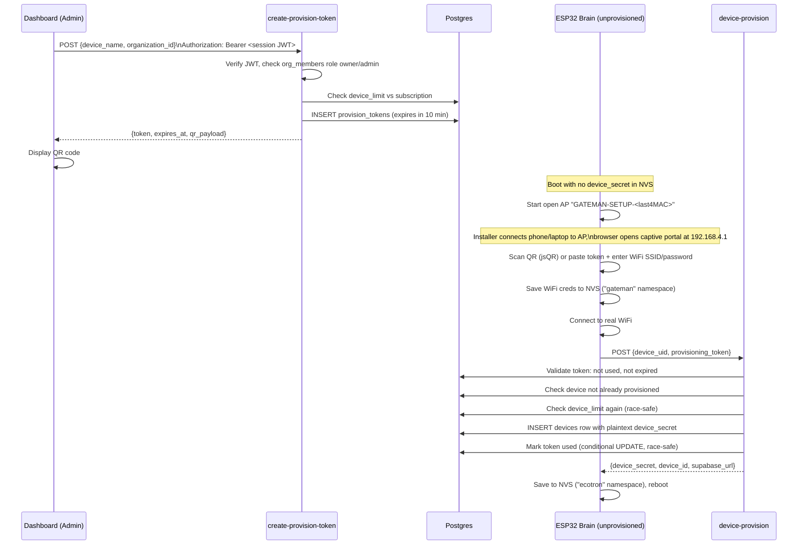

# Device Provisioning

## Current flow (live in v1.0.0)

Token-based provisioning with a QR-code-scannable captive portal. This is the flow implemented in `firmware/wroom_brain/provision_portal.h` and backed by `supabase/functions/create-provision-token` + `supabase/functions/device-provision`.

Key properties, verified against the code:
- Tokens are single-use (`used_at` conditional check) and expire after 10 minutes.
- The token-mark-as-used step uses a conditional `UPDATE ... WHERE used_at IS NULL` to close the race window between two devices redeeming the same token simultaneously.
- Device limit is checked twice — once when the token is generated, once when it's redeemed — because time can pass between the two steps.
- The provisioning AP is **open** (no WiFi password) by design, since the device has no way to communicate a password to the installer before it has WiFi. The captive portal's QR scanner (`jsQR`) is loaded from a CDN, which means the *installer's phone* needs internet access during setup — worth noting as a minor irony for what's otherwise an offline-capable setup step.
- `device_secret` is returned in plaintext exactly once, at provisioning time, and is never shown again (see [`SECURITY.md`](SECURITY.md) for the plaintext-storage tradeoff this implies).

## Abandoned flows (do not implement against these — historical record only)

Three different provisioning UX designs were built within a short window (per `git log`), and two were reverted. This section exists so nobody re-reads the old planning docs and assumes they describe the current system.

1. **MAC-based pairing codes** (`SIMPLIFIED_PROVISIONING.md`, `FINAL_PROVISIONING_FLOW.md`) — device derives a 12-hex-character code from its MAC address, installer types that code into the dashboard, dashboard calls `pair-device`. Backed by `supabase/functions/pair-device`, which is **broken as well as unused** — it queries `organizations.subscription_status`/`organizations.plan_type` columns that don't exist in the actual schema (subscription data lives in the separate `subscriptions` table).
2. **Auto-discovery / claim flow** (`AUTO_DISCOVERY_PROVISIONING.md`) — device announces itself, admin "claims" it from the dashboard without ever seeing a token. Backed by `supabase/functions/claim-device` and `supabase/functions/poll-claim`, plus a `device_claims` table (`supabase/migrations/002_device_claims.sql`).
3. **The current token+QR flow** — reverted back to from #2, per the commit `Revert to token-based provisioning - simpler and proven approach`, then had QR scanning added on top.

`device-login` is a fourth orphaned function (not part of any of the three flows above, and not called by current firmware either) — its exact original purpose is `TODO: Needs verification`, most plausibly an early, simpler credential-check-only endpoint superseded once `device-provision` + the per-endpoint `authenticateDevice()` pattern was established.

All four functions from the abandoned flows (`pair-device`, `claim-device`, `poll-claim`, `device-login`) remain deployed but unreachable from any current client. See [`CLEANUP_REPORT.md`](CLEANUP_REPORT.md) for the removal recommendation and [`SECURITY.md`](SECURITY.md) for the specific risk `poll-claim`'s lack of authentication poses if it were ever reactivated.

## Re-provisioning an existing device

Send `RESET` (or `FACTORY_RESET`) over the USB serial console (115200 baud). This wipes both NVS namespaces (`"ecotron"` and `"gateman"`) and reboots the device back into the unprovisioned flow above. There is no remote/OTA way to trigger this — physical USB access is required, consistent with the project having no OTA capability yet (see [`FIRMWARE.md`](FIRMWARE.md)).

## Manual secret injection (debug only)

The serial command `PROVISION:<secret>` writes an arbitrary string directly into the `device_secret` NVS field, bypassing `device-provision` entirely. This exists as a bring-up/debug convenience, not a supported provisioning path — see [`SECURITY.md`](SECURITY.md) for why it's flagged as a backdoor rather than a feature.
